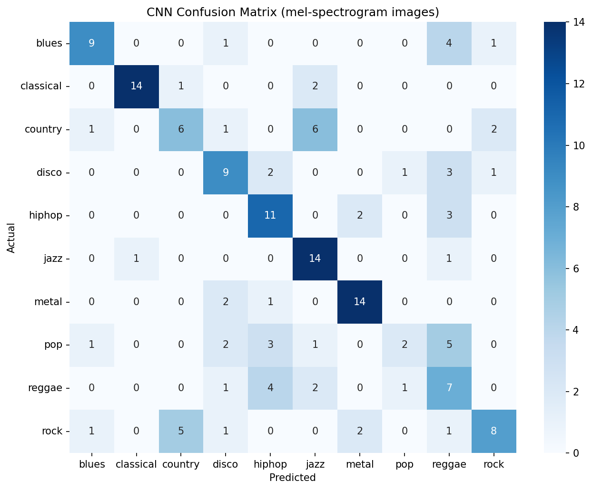

# Task 6: Music Genre Classification

## Problem
Classify audio clips into one of **10 music genres** (blues, classical, country, disco, hiphop, jazz, metal, pop, reggae, rock) from their sonic content.

## Dataset
[GTZAN Genre Collection (Kaggle)](https://www.kaggle.com/datasets/andradaolteanu/gtzan-dataset-music-genre-classification) — 1,000 audio clips (30s each), 10 genres × 100 tracks, with pre-generated mel-spectrogram images and pre-extracted audio features (MFCCs, chroma, spectral centroid, zero-crossing rate, tempo, etc.).

## Approach
- Feature extraction: mel-spectrogram images (`images_original/`) for the CNN; pre-extracted GTZAN audio features (`features_3_sec.csv`) for the tabular models.
- Model(s) tried: **CNN from scratch** (primary), **MobileNetV2 transfer learning** (bonus), and **RandomForest / GradientBoosting / XGBoost** on tabular features (bonus).
- Why this model: spectrograms are 2D spatial representations of audio, so convolutional layers directly capture local time–frequency patterns (rhythm, timbre, pitch). This is compared against cheap tabular models and a pretrained vision backbone.

## Results

| Approach | Accuracy | Macro F1 | Training time (s) |
|---|---|---|---|
| Tabular XGBoost | 0.7211 | 0.7204 | 4.9 |
| Tabular GradientBoosting | 0.6975 | 0.6985 | 253.1 |
| Tabular RandomForest | 0.6755 | 0.6741 | 1.3 |
| Transfer Learning (MobileNetV2) | 0.6312 | 0.6163 | 132.7 |
| CNN (from scratch) | 0.5875 | 0.5708 | 178.6 |

> Best model: **Tabular XGBoost** (matching best simple pipeline). All image-based models beat the 0.10 random baseline, and none is clearly top — the core deliverable (CNN) plus transfer learning confirm the tabular route wins here given only ~640 training images per split.



## Interface
Upload a `.wav` file; the CNN predicts the genre and shows confidence across all 10 genres.


## Bonus work
- [x] Tabular approach (MFCC/audio features) with **track-grouped** splits to avoid leakage
- [x] Image-based CNN (from scratch) vs. tabular comparison
- [x] Transfer learning (MobileNetV2) — frozen base then fine-tuning

## How to run
```bash
pip install -r requirements.txt
python app.py
```
