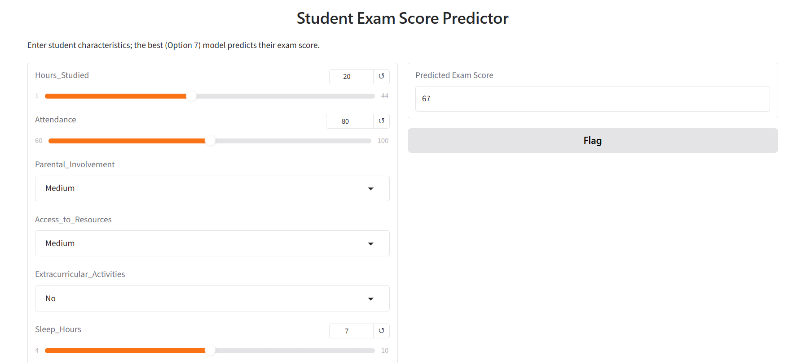

# 🎓 Student Exam Score Predictor

> A machine learning project that predicts students' exam scores using linear regression, trained on 19 behavioral, demographic, and academic features from a dataset of 6,607 students.

---

## 📌 Problem Statement

Predict a student's `Exam_Score` (continuous, 0–100 range) from 19 input features spanning study habits, family background, and school environment.

**Success benchmark:** R² > 0.75 ✅ (met: R² = 0.769 on the held-out test set)

---

## 📂 Dataset

| Property | Value |
|---|---|
| Source | `StudentPerformanceFactors.csv` |
| Size | 6,607 rows × 20 columns |
| Target | `Exam_Score` |
| Features | 19 (6 numerical, 13 categorical) |

### Feature Groups

| Group | Features |
|---|---|
| Study habits / effort | `Hours_Studied`, `Attendance`, `Sleep_Hours`, `Previous_Scores`, `Tutoring_Sessions`, `Physical_Activity` |
| Motivation / disposition | `Motivation_Level`, `Peer_Influence` |
| Family background | `Parental_Involvement`, `Access_to_Resources`, `Family_Income`, `Parental_Education_Level`, `Distance_from_Home`, `Extracurricular_Activities` |
| School / access | `Teacher_Quality`, `School_Type`, `Internet_Access`, `Learning_Disabilities`, `Gender` |

### Preprocessing Steps
- Missing values in 3 categorical columns imputed with the **mode**
- All 13 categorical columns **ordinal/binary encoded** to integers
- Continuous features **winsorized to IQR whiskers** (outliers kept, not dropped)
- **No feature scaling for training** — interpretability was the priority; the coefficient-comparison addendum in Section 8 standardizes the predictors purely to make cross-feature comparisons fair

---

## 🔍 Key EDA Insights

- **Attendance** is the strongest single predictor (r ≈ 0.58)
- **Hours_Studied** is next (r ≈ 0.44), followed by **Tutoring_Sessions** (r ≈ 0.22)
- **No dangerous multicollinearity** — max inter-feature correlation ≈ 0.15
- **Parental_Involvement** and **Motivation_Level** are the strongest categorical predictors
- Relationships are roughly **linear** — polynomial terms added negligible value

---

## 🧪 Models Compared

**Selection protocol (rigor fix):** the best feature combination is chosen by **5-fold cross-validation on the full data** (never on the test set). The chosen model is then evaluated **once** on the untouched held-out test split. Both numbers are reported separately.

All models trained on the same 80/20 split (`random_state=42`).

| Option | Features | 5-fold CV R² (selection) | Held-out Test R² |
|---|---|---|---|
| 1 — Baseline | `Hours_Studied` only | 0.198 ± 0.020 | 0.232 |
| 2 | + Attendance, Previous_Scores, Tutoring | 0.596 ± 0.054 | 0.640 |
| 3 | + Sleep_Hours, Physical_Activity | 0.597 ± 0.055 | 0.640 |
| 4 | + Motivation_Level, Parental_Involvement | 0.636 ± 0.057 | 0.683 |
| 5 | Internet_Access, School_Type, Gender | 0.576 ± 0.055 | 0.623 |
| 6 | + Sleep_Hours, Internet_Access | 0.639 ± 0.058 | 0.683 |
| **7** ✅ | **All 19 features** | **0.726 ± 0.069** | **0.769** |

> Option 7 wins by **both** the selection metric (CV R² = 0.726) and the final test metric (R² = 0.769), so the corrected protocol does not change the chosen model — it only makes the numbers honest.

---

## 🏆 Best Model — Option 7

**Linear Regression on all 19 features**

| Metric | Train | Test |
|---|---|---|
| R² | 0.716 | **0.769** |
| MAE | — | 0.46 |
| RMSE | — | 1.81 |

**Why Option 7 wins:**
- Meets and exceeds the R² > 0.75 benchmark
- Outperforms the best 5-feature model (Option 4/6, R² = 0.683) by **+8.6 pp**
- Outperforms the single-feature baseline (R² = 0.232) by **+53.7 pp**
- 5-fold CV R² = **0.726 ± 0.069** confirms robustness across folds

### 📊 Residual analysis — why MAE (0.46) and RMSE (1.81) differ so much

RMSE exceeds MAE whenever the error distribution is heavy-tailed, because RMSE squares the largest errors before averaging them back out. Inspecting the test residuals directly (Section 10.1):

- **98.6%** of the 1,322 test predictions are within **±1 point** (p99 of |residual| = 1.09)
- The RMSE/MAE gap is produced by **only 7 rows (0.5%)** — students scored 80–98 whose recorded inputs cannot explain those scores (e.g. `Attendance=70, Hours_Studied=19, Previous_Scores=54` predicted at **61.1** yet scored **89**)
- These are internally inconsistent rows of the generated dataset (the left-skewed high-score cluster flagged in the EDA), **not a model failure**
- Dropping only those 7 rows from the evaluation drops RMSE to **0.42** and MAE to **0.34** — for the other 99.5% of students the model is accurate to sub-half-a-point
- **The model was not retrained**; the outliers are kept and reported rather than masked, and both numbers are given here for honesty

---

## 🗂️ Repo Structure

```
task1/
├── student_performance_analysis.ipynb   # Full EDA, training, evaluation, and residual analysis
├── StudentPerformanceFactors.csv        # Raw dataset (6,607 × 20)
├── app.py                               # Standalone Gradio inference app
├── requirements.txt                     # Pinned dependencies (scikit-learn ==1.7.2)
├── assets/
│   └── gradio_demo.png                  # Screenshot of the Gradio app
└── models/
    ├── best_model.pkl                   # Serialized Option-7 LinearRegression (joblib)
    └── encode_maps.pkl                  # Encoding map shared by training & inference
```

---

## 🖼️ Demo



The standalone Gradio app (`app.py`) reproduces the notebook's Section-12 interactive demo.

---

## ⚙️ Run It Locally

```bash
git clone https://github.com/M-Amine-HM/student-score-predictor
cd student-score-predictor/task1

# Install pinned dependencies (scikit-learn pinned to ==1.7.2)
python -m pip install -r requirements.txt

# Launch the Gradio app
python app.py
```

Then open the local URL printed in your terminal (typically `http://127.0.0.1:7860/`).

> ⚠️ The model was trained with **scikit-learn 1.7.2**, which is pinned in `requirements.txt` to ensure `best_model.pkl` and `encode_maps.pkl` load correctly. Do not upgrade scikit-learn or the .pkl files may not unpickle.

---

## 🛠️ Tech Stack

| Library | Purpose |
|---|---|
| `pandas` | Data loading and manipulation |
| `numpy` | Numerical operations |
| `matplotlib` / `seaborn` | EDA visualizations |
| `scikit-learn` | Model training and evaluation |
| `joblib` | Model serialization |
| `gradio` | Interactive demo UI |

---

## 👤 Author

- **Author:** Mohamed ElAmine Haj Mohamed
- **GitHub:** [github.com/M-Amine-HM](https://github.com/M-Amine-HM)
- **Portfolio:** [aminehm-portfolio.vercel.app](https://aminehm-portfolio.vercel.app)
- **License:** MIT