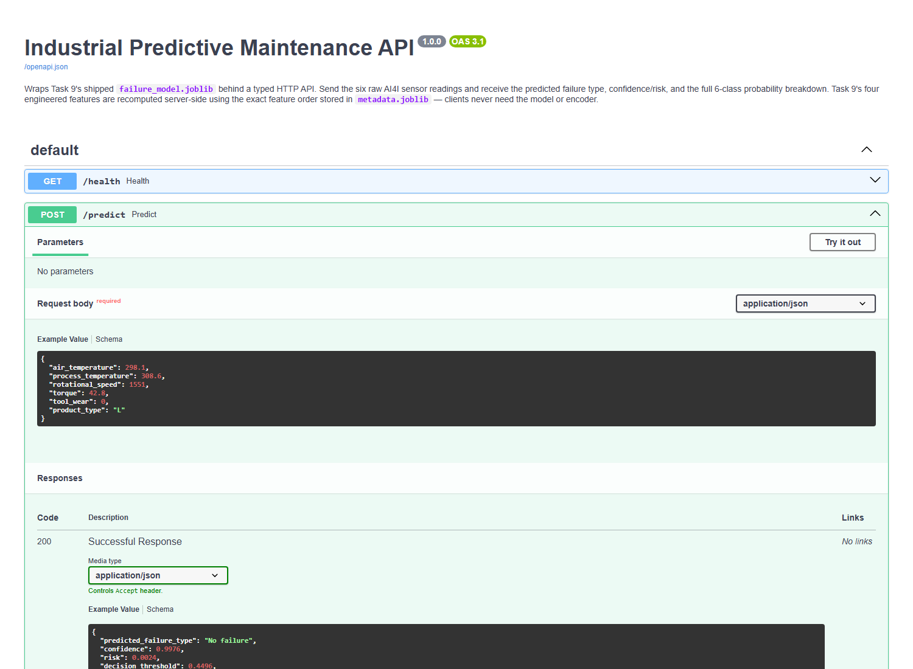
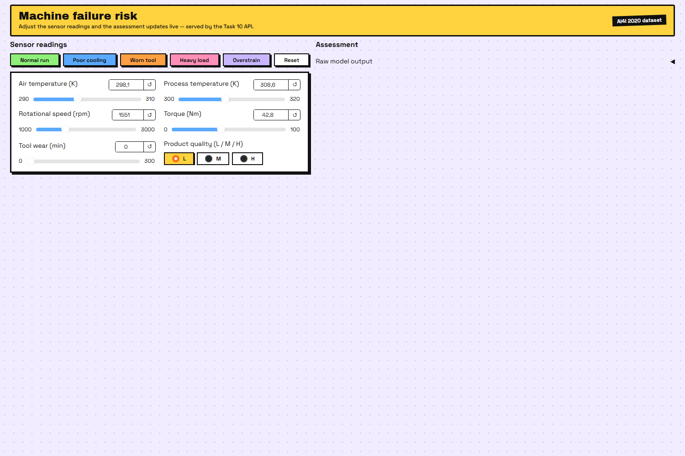

# Task 10: End-to-End MLOps Pipeline

## Problem
Take Task 9's shipped predictive-maintenance model out of the notebook/app and
ship it as a production-shaped service: a FastAPI backend owns the model, a
Gradio frontend talks to it over HTTP (no model loaded client-side), and
Docker Compose orchestrates both behind healthcheck-gated startup.

## Source model
Wraps Task 9 (Industrial Predictive Maintenance) — [task-09 folder](../task9-Industrial-Predictive-Maintenance).
Reported Task 9 test metrics: FDR 0.1887, Precision 0.8113, Recall 0.6143,
Accuracy 0.9815, Macro F1 0.5721.

Artifacts are copied verbatim from Task 9 and re-verified before building on
them: loading `failure_model.joblib` + `feature_encoder.joblib` +
`metadata.joblib` and re-running the model on the untouched 20% test split
reproduces exactly those numbers (FDR 0.1887, Precision 0.8113, Recall 0.6143,
Accuracy 0.9815, Macro F1 0.5721). `main.py` loads the same three artifacts —
the `feature_encoder.joblib` is required in addition to the two files named in
the brief because failing to apply Task 9's one-hot encoding of the `Type`
column would silently change predictions.

## Architecture
API (FastAPI, port 8000) + Frontend (Gradio, port 7860), orchestrated via
docker-compose. Frontend calls API over HTTP; no model loaded client-side.

```
task-10-mlops-pipeline/
├── main.py                  ← FastAPI service (loads model ONCE at startup)
├── schemas.py               ← Pydantic input/output schemas (+ range validation)
├── Dockerfile               ← API image (python:3.12-slim, scikit-learn==1.9.0)
├── docker-compose.yml       ← api + frontend on one network, healthcheck-gated
├── requirements.txt         ← API + test dependencies
├── models/                  ← Task 9 artifacts (failure_model, feature_encoder, metadata)
├── frontend/
│   ├── app.py               ← Gradio UI as a thin HTTP client of the API
│   ├── Dockerfile           ← frontend image (gradio, requests — no sklearn/xgboost)
│   └── requirements.txt
├── tests/test_api.py        ← pytest via FastAPI TestClient (no container needed)
├── .github/workflows/ci.yml ← test on push
└── assets/                  ← demo screenshots
```

## Approach

### API design
- **Artifacts loaded once at import time** (`main.py:20`), never per request.
- `POST /predict` — accepts the Pydantic-validated sensor input, recomputes Task
  9's four engineered features **in the exact order stored in
  `metadata['feature_columns']`**, runs the encoder + `predict_proba`, applies
  Task 9's frozen decision rule (`decision_threshold = 0.4496`), and returns the
  predicted failure type, confidence, risk, threshold, and the full 6-class
  probability breakdown.
- `GET /health` — liveness probe used by the Compose healthcheck; also reports
  whether the model is loaded.
- `GET /docs` — auto-generated Swagger UI; input/output schemas carry
  descriptive field names, ranges and examples so the docs double as a demo.

### Input/output schemas (`schemas.py`)
`SensorInput` mirrors Task 9's real feature set (pulled from `metadata.joblib`,
not guessed): `air_temperature`, `process_temperature` (K), `rotational_speed`
(rpm), `torque` (Nm), `tool_wear` (min), and `product_type` (`L`/`M`/`H` — the
`Type` column). Pydantic enforces physical ranges so nonsense is rejected before
it reaches the model (e.g. temperature inside 240–350 K, `process_temperature`
must exceed `air_temperature`). `PredictionOutput` returns the predicted class
(string), confidence/risk (floats) and the per-class probability dictionary.

### Validation — 400 cases covered
FastAPI's default request-validation status is 422; this service remaps every
`RequestValidationError` to **400** (`main.py:44`) so bad input always fails the
same way. Covered cases:

| Case | Example | Status |
|---|---|---|
| Valid input | full valid JSON | 200 |
| Wrong type | `"torque": "not-a-number"` | 400 |
| Missing required field | omit `tool_wear` | 400 |
| Out of range | `air_temperature: 50` | 400 |
| Physical inconsistency | `process_temperature <= air_temperature` | 400 |

### Containerization
Two-service Compose setup on a shared `mlops-net` bridge network. `api` exposes
8000; `frontend` exposes 7860 and sets `API_BASE_URL=http://api:8000` (the
Compose **service name**, not `localhost`). `frontend` declares
`depends_on: api: condition: service_healthy` against `GET /health` so the UI
never starts hitting the API before it is ready. The frontend image installs
only `gradio` + `requests` — the model stays server-side. The API pins the
scikit-learn version the artifacts were trained with (`1.9.0`) so unpickling is
exact and warning-free in the container.

## Results

### Example valid request/response (Swagger UI screenshot)



```bash
curl -s http://localhost:8000/predict \
  -H "Content-Type: application/json" \
  -d '{"air_temperature":299.0,"process_temperature":309.5,
       "rotational_speed":1380,"torque":60.0,"tool_wear":200.0,
       "product_type":"L"}'
```

```json
{
  "predicted_failure_type": "Overstrain Failure",
  "confidence": 0.6872,
  "risk": 0.6872,
  "decision_threshold": 0.4496,
  "failure_probabilities": {
    "Heat Dissipation Failure": 0.007,
    "No failure": 0.2624,
    "Overstrain Failure": 0.6872,
    "Power Failure": 0.0421,
    "Random Failure": 0.0,
    "Tool Wear Failure": 0.0013
  }
}
```

### Example invalid request → 400

```bash
curl -s -o /dev/null -w "%{http_code}" http://localhost:8000/predict \
  -H "Content-Type: application/json" \
  -d '{"air_temperature":50,"process_temperature":308.6,"rotational_speed":1551,
       "torque":42.8,"tool_wear":0,"product_type":"L"}'
# -> 400  (air_temperature outside 240–350 K)
```

## Frontend
The existing Task 9 Gradio interface is unchanged in layout — same sliders,
presets, live-updating assessment panel, gauge and probability bars — but the
backend call is now `POST http://api:8000/predict` (`requests`), and API
failures (unreachable service, 400 validation, bad JSON) render as a clear
inline error instead of an unhandled exception.



## Bonus work
- [x] Gradio frontend as a live API client (no scikit-learn/joblib in the UI image)
- [x] GitHub Action CI on push (installs `requirements.txt`, runs `pytest tests/`)
- [x] Compose healthcheck-gated startup (`depends_on.condition: service_healthy`)
- [x] Full 6-class per-class probability payload for /docs and downstream consumers

## How to run
```bash
docker-compose up --build
# API + Swagger docs: http://localhost:8000/docs
# Gradio frontend:    http://localhost:7860
```

First build pulls the base images and installs scikit-learn, so give it a
minute or two. When both containers are `healthy`/`running`, open
`localhost:7860` — the assessment panel updates live through the API. To run
the frontend on the host against a containerized API, override the env var:

```bash
# PowerShell:  $env:API_BASE_URL="http://localhost:8000"
# bash:        API_BASE_URL=http://localhost:8000 python frontend/app.py
```

## Tests
```bash
pip install -r requirements.txt
pytest tests/
```

Runs against the FastAPI `TestClient` — no Docker needed. Covers: valid input →
200 with the expected JSON shape (all 6 classes, probabilities summing to 1),
wrong type → 400, missing field → 400, out-of-range value → 400, and the
physical `process_temperature <= air_temperature` constraint → 400.

## CI
`.github/workflows/ci.yml` runs on push: Python 3.12, `pip install -r
requirements.txt`, `pytest tests/`. The model artifacts under `models/` are
committed (a `.gitignore` exception mirrors the Task 8 precedent) so CI has
everything it needs without a live container.