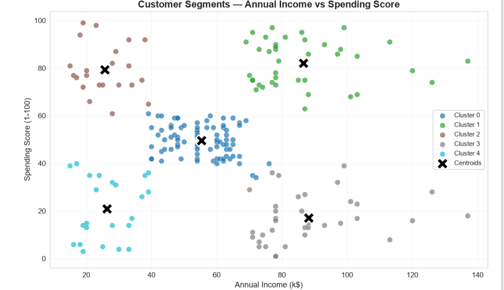
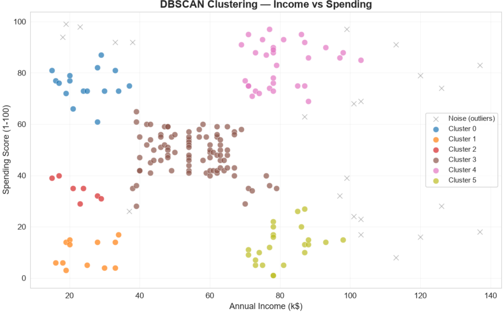
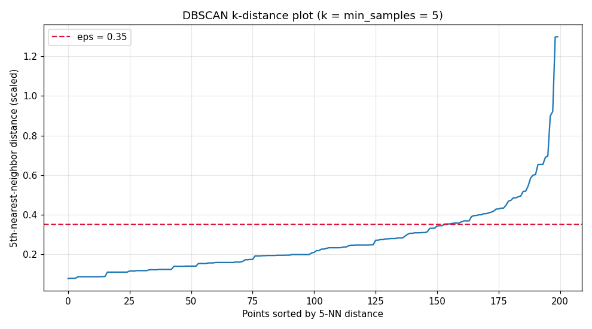

# 🎯 Customer Segmentation using K-Means & DBSCAN


---

## 📌 Project Overview

This project segments mall customers into distinct groups based on their **Annual Income** and **Spending Score** using unsupervised machine learning techniques. The goal is to help businesses understand customer behavior, identify high-value segments, and tailor marketing strategies accordingly.

Two clustering algorithms are explored and compared:

- **K-Means** — A centroid-based algorithm that partitions customers into a predefined number of clusters.
- **DBSCAN** — A density-based algorithm that discovers clusters of arbitrary shape and identifies noise/outlier points.

An interactive **Gradio web app** is included, allowing users to explore different clustering configurations in real-time.

---

## 📊 Dataset

**File:** `Mall_Customers.xlsx`

| Column | Description |
|--------|-------------|
| `CustomerID` | Unique identifier for each customer |
| `Gender` | Male (M) or Female (F) |
| `Age` | Customer age in years |
| `Education` | Education level (High School, College, Graduate, etc.) |
| `Marital Status` | Married, Single, Divorced, or Unknown |
| `Annual Income (k$)` | Annual income in thousands of dollars |
| `Spending Score (1-100)` | Score assigned by the mall based on spending behavior |

- **Records:** 200 customers
- **Source:** [Mall Customer Dataset on Kaggle](https://www.kaggle.com/datasets/simtoor/mall-customers)

---

## 📁 Project Structure

```
customer-segmentation/
├── customer_segmentation.ipynb   # Main notebook (all sections, incl. model export)
├── Mall_Customers.xlsx           # Source dataset
├── app.py                        # Standalone Gradio app (loads from models/, no notebook dependency)
├── requirements.txt              # Pinned dependencies
├── models/                       # Saved artifacts: kmeans.pkl, scaler.pkl, dbscan.pkl, params.json
└── README.md                     # This file
```

---

## 🧠 Covered Topics

| Topic | Description |
|-------|-------------|
| **Clustering** | Grouping similar data points together without predefined labels to discover natural customer segments |
| **Unsupervised Learning** | Machine learning on unlabeled data — the model discovers hidden patterns on its own |
| **Feature Scaling** | Standardizing features to zero mean and unit variance so distance-based algorithms treat all features equally |
| **Visual Exploration** | EDA through distribution plots, countplots, heatmaps, and scatter plots to understand data before modeling |

---

## 🔁 Workflow / Pipeline

The notebook follows a structured 15-step pipeline:

| Step | Section | Description |
|------|---------|-------------|
| 1 | **Installations** | Install `gradio` and `openpyxl` via pip |
| 2 | **Imports** | Import all libraries (pandas, numpy, matplotlib, seaborn, sklearn, gradio) and set global plot styles |
| 3 | **Load Dataset** | Load `Mall_Customers.xlsx`, clean column names, display shape and dtypes |
| 4 | **EDA** | Distribution plots (Age, Income, Spending), countplots (Gender, Education, Marital Status), correlation heatmap |
| 5 | **Data Cleaning** | Handle "Unknown" values in Marital Status, check nulls, keep categoricals raw (no label-encoding — clustering only uses the two numeric features) |
| 6 | **Feature Selection & Scaling** | Select Income + Spending as core features, apply `StandardScaler` |
| 7 | **Elbow Method** | Plot inertia for k=1 to 10 to visually identify the optimal number of clusters |
| 8 | **Silhouette Score** | Compute silhouette scores for k=2 to 10, select optimal k programmatically |
| 9 | **K-Means Clustering** | Fit KMeans with optimal k, assign cluster labels to each customer |
| 10 | **Cluster Visualization** | 2D scatter plot colored by cluster with centroids marked as black X |
| 11 | **Cluster Analysis** | Mean profiles per cluster, Gender/Education distribution, avg spending bar chart, interpretations |
| 12 | **DBSCAN (Bonus)** | k-distance + parameter sweep justify eps/min_samples, then fit DBSCAN, visualize clusters, handle noise points |
| 13 | **Quantitative Comparison** | Silhouette + Davies-Bouldin for K-Means vs DBSCAN on the same scaled features |
| 14 | **Model Export** | Save `kmeans.pkl`, `scaler.pkl`, `dbscan.pkl`, `params.json` to `models/` |
| 15 | **Gradio App** | Interactive web interface with algorithm selector, cluster slider, scatter plot, summary table, and spending chart |

---

## 🏆 Key Results

### Optimal Clusters: 5 clusters

Chosen **programmatically by the highest Silhouette Score** (never hardcoded). The scores
for k = 2 to 10 on the scaled features are:

| k | Silhouette |
|----|-----------|
| 2 | 0.3213 |
| 3 | 0.4666 |
| 4 | 0.4939 |
| **5** | **0.5547** ← best |
| 6 | 0.5399 |
| 7 | 0.5281 |
| 8 | 0.4552 |
| 9 | 0.4571 |
| 10 | 0.4432 |

k=5 clearly wins: its silhouette is 0.5547, a full 0.0148 above the next-best k=6 (0.5399)
and ~25% above the elbow-implied candidate k=3. With k=5 every one of the 200 customers
is assigned to one of 5 well-separated segments, so `kmeans.pkl` is the primary model.

### Cluster Interpretations

| Cluster | Profile | Description |
|---------|---------|-------------|
| 0 | 🔴 High Income, Low Spenders | Wealthy customers who spend conservatively — potential targets for premium product marketing |
| 1 | 🔵 Low Income, High Spenders | Budget-conscious customers with high spending behavior — may benefit from loyalty programs |
| 2 | 🟢 High Income, High Spenders | The most valuable segment — high earning and high spending, ideal for VIP/upsell strategies |
| 3 | 🟡 Low Income, Low Spenders | Cost-sensitive customers with limited spending — targets for discounts and promotions |
| 4 | 🟠 Medium Income, Medium Spenders | Average customers with balanced behavior — steady revenue, potential for growth |

> **Note:** Cluster count and interpretations may vary. The notebook generates these dynamically based on the computed optimal k.

### DBSCAN vs K-Means

| Aspect | K-Means | DBSCAN |
|--------|---------|--------|
| Cluster count | Determined by Silhouette Score (k=5) | Derived from data density |
| Noise handling | None — every point is assigned | Identifies outlier/noise points (label = -1) |
| Cluster shape | Spherical only | Arbitrary shapes |
| Input needed | Must specify k | No k needed |

**DBSCAN parameter choice (eps, min_samples).** `eps=0.35` and `min_samples=5` are **not**
hardcoded guesses. The notebook justifies them two ways: (1) a **k-distance plot** with
k = min_samples = 5 shows the sorted 5th-nearest-neighbor distances rising sharply just
past a "knee" at ≈ 0.35 scaled units (p75 = 0.334), so points closer than 0.35 genuinely
form dense cores; and (2) a small **parameter sweep** over eps × min_samples confirms
(0.35, 5) finds 6 substantial clusters with only 23 noise points (11.5%) and a strong
silhouette (0.5577) — larger eps merges cores, smaller eps over-fragments. The constants
are defined **once** in the notebook and referenced by both the fit and the Gradio app
(and persisted in `models/params.json` for the standalone `app.py`), so the demo can
never drift from the training fit.

**Quantitative comparison (same scaled features).**

| Metric | K-Means (k=5) | DBSCAN (eps=0.35, min_samples=5) |
|--------|--------------|----------------------------------|
| Clusters found | 5 | 6 |
| Noise points | 0 (everyone assigned) | 23 (11.5% of data) |
| Silhouette score (↑) | **0.5547** | 0.5577* |
| Davies-Bouldin (↓) | 0.5722 | **0.5106*** |

\* computed on the 177 non-noise points — DBSCAN leaves the 23 noise points unlabeled.

**Honest takeaway:** they are **essentially tied**. DBSCAN scores marginally better on
both quantitative metrics, but only after excluding its 23 noise points from the
calculation — and those are exactly the customers K-Means *does* manage to assign.
There is **no definitive winner**: K-Means produces clean, fully-assigned, business-ready
segments (exported as the primary model), while DBSCAN is kept because it surfaces
genuine outliers worth investigating. The Gradio app lets you compare them live.

---

## 🚀 How to Run

### 1. Clone the repository

```bash
git clone https://github.com/M-Amine-HM/customer-segmentation.git
cd customer-segmentation
```

### 2. Install dependencies

```bash
pip install -r requirements.txt
```

### 3. Launch the Gradio app (standalone, no notebook required)

```bash
python app.py
```

The app loads the saved artifacts from `models/` (`kmeans.pkl`, `scaler.pkl`,
`dbscan.pkl`, `params.json`) and opens `http://127.0.0.1:7860/` in your browser.

### 4. Open the notebook (optional — for training/EDA)

```bash
jupyter notebook customer_segmentation.ipynb
```

### 5. Run all cells

In Jupyter Notebook, go to **Kernel → Restart & Run All**, or run each cell sequentially
with `Shift + Enter`. Cell 31 exports the fitted artifacts to `models/`; the final cell
launches the same Gradio interface. Re-run the notebook only if you intentionally want to
retain a fresh set of models.

---

## 📦 Requirements

All dependencies are **pinned in `requirements.txt`** so the saved `models/` artifacts
load with the exact same library versions they were trained with:

```
pandas==2.3.3
numpy==2.0.2
matplotlib==3.10.8
seaborn==0.13.2
scikit-learn==1.7.2
joblib==1.5.3
gradio==6.26.0
openpyxl==3.1.5
```

Install all dependencies at once:

```bash
pip install -r requirements.txt
```

> ⚠️ Do not upgrade `scikit-learn` or `joblib`: the `.pkl` artifacts may fail to load.

---

## 🖥️ Interactive Demo

Two ways to run the **Gradio web app**:

1. **Standalone:** `python app.py` — loads the saved models from `models/` with no
   notebook dependency.
2. **From the notebook:** the final cell (Section 15) launches the identical interface.

| Feature | Description |
|---------|-------------|
| **Algorithm Selector** | Choose between K-Means and DBSCAN clustering |
| **Cluster Slider** | Adjust the number of clusters for K-Means (2–10, default = the silhouette-selected k=5) |
| **Scatter Plot** | Live 2D visualization of customer segments (Income vs Spending) |
| **Summary Table** | Average Age, Income, Spending Score, and count per cluster |
| **Spending Bar Chart** | Horizontal bar chart showing average spending per cluster, sorted descending |

---

## 📸 Screenshots

### 📈 Elbow Method


### 📊 Silhouette Score


### 🎨 K-Means Cluster Visualization

### 🎨 DBSCAN Clustering

### 📉 DBSCAN k-distance plot (parameter justification)


### 🖥️ Gradio Interactive App


---

## 👤 Author

**Amine**

[](https://github.com/M-Amine-HM)

---

## 📄 License

This project is open source and available for educational and personal use.
