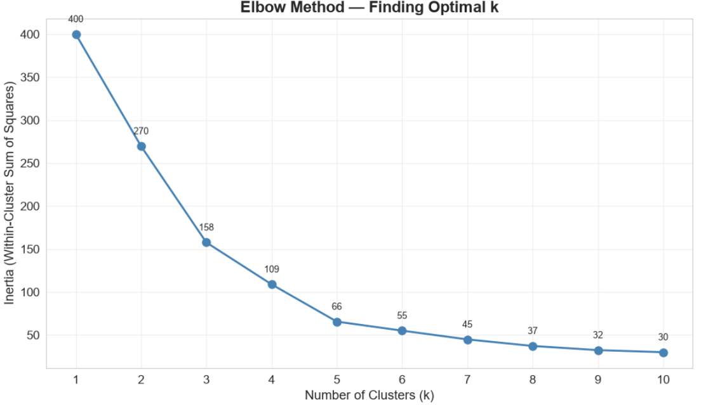
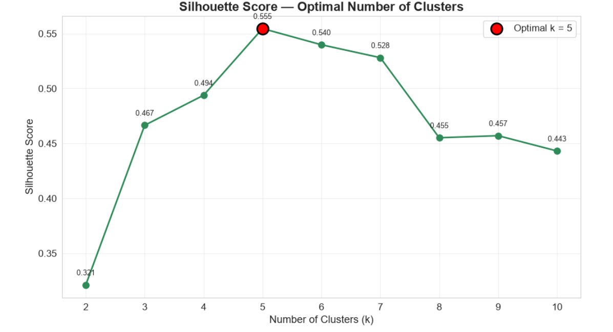
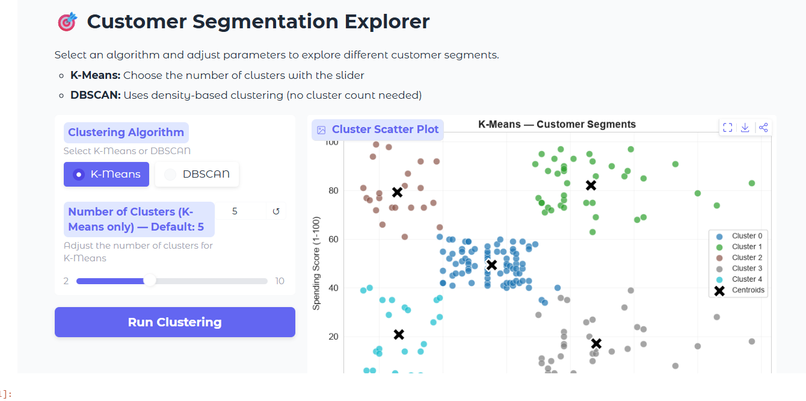

# 🎯 Customer Segmentation using K-Means & DBSCAN


---

## 📌 Project Overview

This project segments mall customers into distinct groups based on their **Annual Income** and **Spending Score** using unsupervised machine learning techniques. The goal is to help businesses understand customer behavior, identify high-value segments, and tailor marketing strategies accordingly.

Two clustering algorithms are explored and compared:

- **K-Means** — A centroid-based algorithm that partitions customers into a predefined number of clusters.
- **DBSCAN** — A density-based algorithm that discovers clusters of arbitrary shape and identifies noise/outlier points.

An interactive **Gradio web app** is included, allowing users to explore different clustering configurations in real-time.

---

## 📊 Dataset

**File:** `Mall_Customers.xlsx`

| Column | Description |
|--------|-------------|
| `CustomerID` | Unique identifier for each customer |
| `Gender` | Male (M) or Female (F) |
| `Age` | Customer age in years |
| `Education` | Education level (High School, College, Graduate, etc.) |
| `Marital Status` | Married, Single, Divorced, or Unknown |
| `Annual Income (k$)` | Annual income in thousands of dollars |
| `Spending Score (1-100)` | Score assigned by the mall based on spending behavior |

- **Records:** 200 customers
- **Source:** [Mall Customer Dataset on Kaggle](https://www.kaggle.com/datasets/simtoor/mall-customers)

---

## 📁 Project Structure

```
customer-segmentation/
├── customer_segmentation.ipynb   # Main notebook (all 13 sections)
├── Mall_Customers.xlsx           # Source dataset
└── README.md                     # This file
```

---

## 🧠 Covered Topics

| Topic | Description |
|-------|-------------|
| **Clustering** | Grouping similar data points together without predefined labels to discover natural customer segments |
| **Unsupervised Learning** | Machine learning on unlabeled data — the model discovers hidden patterns on its own |
| **Feature Scaling** | Standardizing features to zero mean and unit variance so distance-based algorithms treat all features equally |
| **Visual Exploration** | EDA through distribution plots, countplots, heatmaps, and scatter plots to understand data before modeling |

---

## 🔁 Workflow / Pipeline

The notebook follows a structured 13-step pipeline:

| Step | Section | Description |
|------|---------|-------------|
| 1 | **Installations** | Install `gradio` and `openpyxl` via pip |
| 2 | **Imports** | Import all libraries (pandas, numpy, matplotlib, seaborn, sklearn, gradio) and set global plot styles |
| 3 | **Load Dataset** | Load `Mall_Customers.xlsx`, clean column names, display shape and dtypes |
| 4 | **EDA** | Distribution plots (Age, Income, Spending), countplots (Gender, Education, Marital Status), correlation heatmap |
| 5 | **Data Cleaning** | Handle "Unknown" values in Marital Status, check nulls, label-encode categorical columns |
| 6 | **Feature Selection & Scaling** | Select Income + Spending as core features, apply `StandardScaler` |
| 7 | **Elbow Method** | Plot inertia for k=1 to 10 to visually identify the optimal number of clusters |
| 8 | **Silhouette Score** | Compute silhouette scores for k=2 to 10, select optimal k programmatically |
| 9 | **K-Means Clustering** | Fit KMeans with optimal k, assign cluster labels to each customer |
| 10 | **Cluster Visualization** | 2D scatter plot colored by cluster with centroids marked as black X |
| 11 | **Cluster Analysis** | Mean profiles per cluster, Gender/Education distribution, avg spending bar chart, interpretations |
| 12 | **DBSCAN (Bonus)** | Apply DBSCAN, visualize clusters, handle noise points, compare vs K-Means |
| 13 | **Gradio App** | Interactive web interface with algorithm selector, cluster slider, scatter plot, summary table, and spending chart |

---

## 🏆 Key Results

### Optimal Clusters: `X clusters`

> **Note:** The optimal k is derived programmatically from the Silhouette Score (never hardcoded). Run the notebook to see the exact value.

### Cluster Interpretations

| Cluster | Profile | Description |
|---------|---------|-------------|
| 0 | 🔴 High Income, Low Spenders | Wealthy customers who spend conservatively — potential targets for premium product marketing |
| 1 | 🔵 Low Income, High Spenders | Budget-conscious customers with high spending behavior — may benefit from loyalty programs |
| 2 | 🟢 High Income, High Spenders | The most valuable segment — high earning and high spending, ideal for VIP/upsell strategies |
| 3 | 🟡 Low Income, Low Spenders | Cost-sensitive customers with limited spending — targets for discounts and promotions |
| 4 | 🟠 Medium Income, Medium Spenders | Average customers with balanced behavior — steady revenue, potential for growth |

> **Note:** Cluster count and interpretations may vary. The notebook generates these dynamically based on the computed optimal k.

### DBSCAN vs K-Means

| Aspect | K-Means | DBSCAN |
|--------|---------|--------|
| Cluster count | Determined by Silhouette Score | Derived from data density |
| Noise handling | None — every point is assigned | Identifies outlier/noise points (label = -1) |
| Cluster shape | Spherical only | Arbitrary shapes |
| Input needed | Must specify k | No k needed |

---

## 🚀 How to Run

### 1. Clone the repository

```bash
git clone https://github.com/M-Amine-HM/customer-segmentation.git
cd customer-segmentation
```

### 2. Install dependencies

```bash
pip install -r requirements.txt
```

### 3. Open the notebook

```bash
jupyter notebook customer_segmentation.ipynb
```

### 4. Run all cells

In Jupyter Notebook, go to **Kernel → Restart & Run All**, or run each cell sequentially with `Shift + Enter`.

### 5. Launch the Gradio App

The last cell in the notebook launches a Gradio interface with a **public shareable URL** (`share=True`). Click the URL to open the interactive demo in your browser.

---

## 📦 Requirements

```
pandas>=2.0
numpy>=1.24
matplotlib>=3.7
seaborn>=0.13
scikit-learn>=1.5
gradio>=5.0
openpyxl>=3.1
```

Install all dependencies at once:

```bash
pip install pandas numpy matplotlib seaborn scikit-learn gradio openpyxl
```

---

## 🖥️ Interactive Demo

The project includes a **Gradio web app** launched from the final cell of the notebook. It features:

| Feature | Description |
|---------|-------------|
| **Algorithm Selector** | Choose between K-Means and DBSCAN clustering |
| **Cluster Slider** | Adjust the number of clusters for K-Means (2–10) |
| **Scatter Plot** | Live 2D visualization of customer segments (Income vs Spending) |
| **Summary Table** | Average Age, Income, Spending Score, and count per cluster |
| **Spending Bar Chart** | Horizontal bar chart showing average spending per cluster, sorted descending |

The app launches with `share=True`, generating a public URL that works from any device — no local setup required for viewers.

---

## 📸 Screenshots

### 📈 Elbow Method


### 📊 Silhouette Score


### 🎨 K-Means Cluster Visualization

### 🎨 DBSCAN Clustering


### 🖥️ Gradio Interactive App


---

## 👤 Author

**Amine**

[](https://github.com/M-Amine-HM)

---

## 📄 License

This project is open source and available for educational and personal use.
