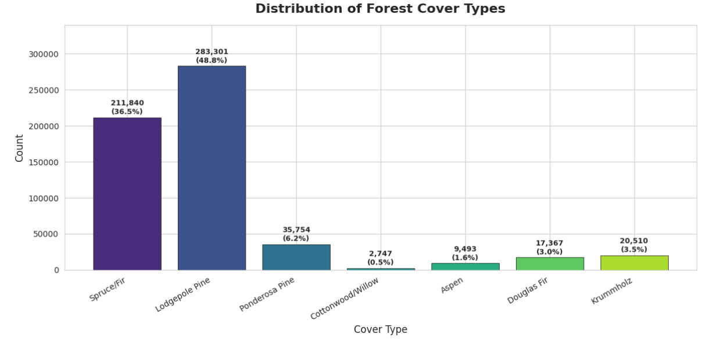
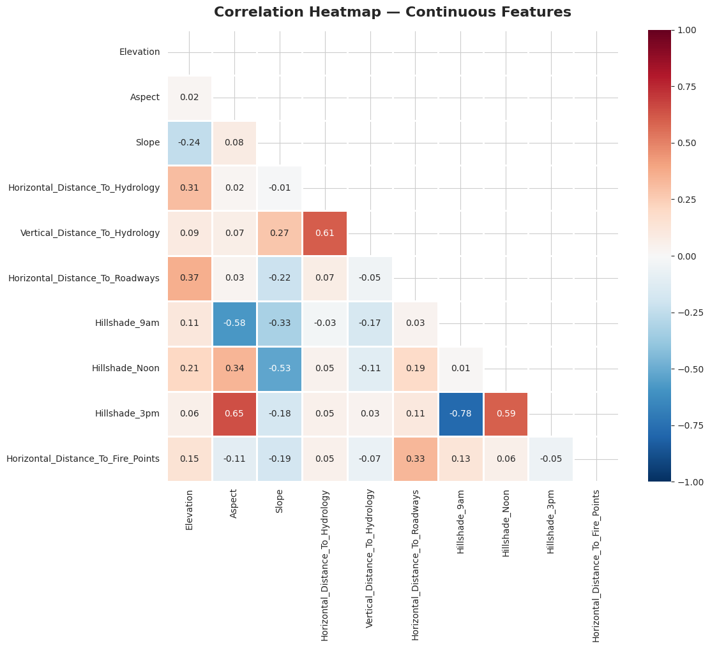
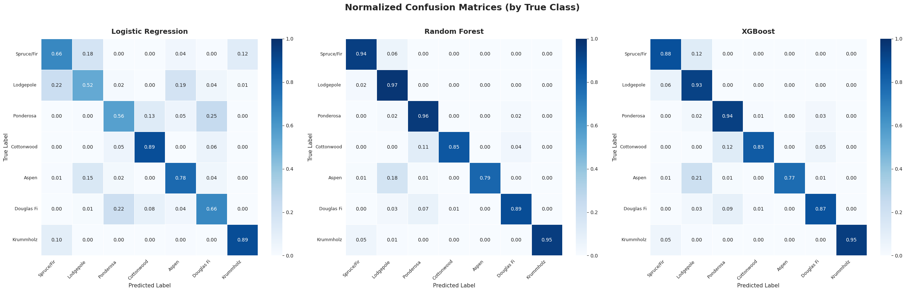
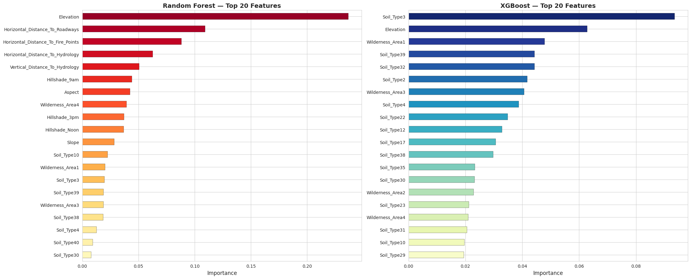
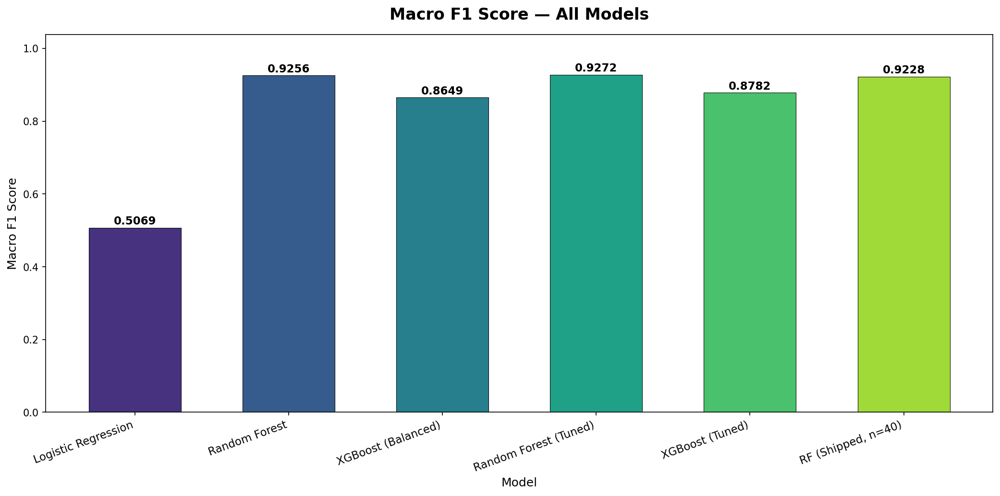
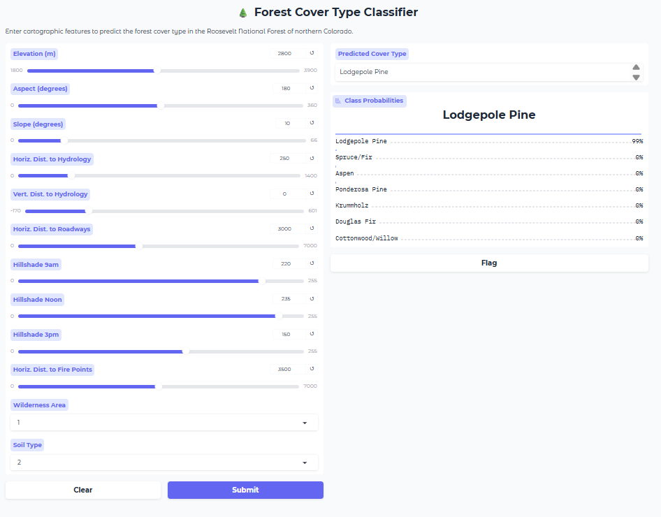

# 🌲 Forest Cover Type Classification

[](https://www.python.org/)
[](https://scikit-learn.org/)
[](https://xgboost.readthedocs.io/)
[](https://www.gradio.app/)
[](./LICENSE)

A supervised multi-class classification pipeline that predicts the predominant forest cover type from cartographic features in the Roosevelt National Forest of northern Colorado. Trained on the UCI Covertype dataset (581,012 samples), the project compares Logistic Regression, Random Forest, and XGBoost — with the tuned Random Forest achieving **95.4% accuracy** and **0.9272 Macro F1** on the test set. The shipped model is a 40-tree version of that Random Forest (81.5 MB), kept under GitHub's 100 MB file limit.

---

## 📌 Project Overview

| | |
|---|---|
| **Problem** | Predict forest cover type (7 classes) from 54 cartographic features |
| **Dataset** | UCI Covertype — 581,012 rows, 54 features, 7 classes |
| **Approach** | Supervised multi-class classification with class-balanced training |
| **Best Model** | Tuned Random Forest — **95.4% Accuracy**, **0.9272 Macro F1**, **0.9261 Kappa** |
| **Shipped Model** | 40-tree Random Forest (81.5 MB) — fits GitHub's 100 MB limit |

---

## 📁 Project Structure

```
task3/
├── forestcover-type-classification.ipynb   ← Main notebook
├── covtype.data                            ← Raw UCI dataset
├── requirements.txt                        ← Pinned dependencies
├── README.md                               ← This file
├── models/
│   ├── best_rf_model.joblib                ← SHIPPED Random Forest (40 trees, 81.5 MB)
│   ├── best_xgb_model.joblib               ← Saved XGBoost (tuned, balanced)
│   ├── scaler.joblib                       ← Saved StandardScaler (fit on train only)
│   └── params.json                         ← Preprocessing + model metadata
└── screenshots/
    ├── class_distribution.png              ← Target class bar chart
    ├── correlation_heatmap.png             ← Continuous feature correlations
    ├── confusion_matrices.png              ← Normalized confusion matrices
    ├── features_importance.png             ← RF vs XGBoost top-20 features
    ├── models_comparison.png               ← Macro F1 bar chart (all models)
    └── gradio_interface.png                ← Live prediction UI
```

---

## 📊 Dataset

**Source:** [UCI Machine Learning Repository — Covertype Dataset](https://archive.ics.uci.edu/ml/datasets/covertype)

| Property | Value |
|---|---|
| Rows | 581,012 |
| Features | 54 (10 continuous + 44 binary) |
| Target | Cover_Type (7 classes) |
| Missing Values | None |
| Memory | ~255.6 MB |

### Feature Groups

| Group | Features | Count |
|---|---|---|
| Continuous | Elevation, Aspect, Slope, Horizontal/Vertical Distance To Hydrology, Horizontal Distance To Roadways, Hillshade (9am/Noon/3pm), Horizontal Distance To Fire Points | 10 |
| Wilderness Areas | One-hot encoded binary indicators | 4 |
| Soil Types | One-hot encoded binary indicators | 40 |
| Target | Cover_Type (integer 1–7) | 1 |

### Cover Types

| Class | Name | Samples | Percentage |
|---|---|---|---|
| 1 | Spruce/Fir | 211,840 | 36.5% |
| 2 | Lodgepole Pine | 283,301 | 48.8% |
| 3 | Ponderosa Pine | 35,754 | 6.2% |
| 4 | Cottonwood/Willow | 2,747 | 0.5% |
| 5 | Aspen | 9,493 | 1.6% |
| 6 | Douglas Fir | 17,367 | 3.0% |
| 7 | Krummholz | 20,510 | 3.5% |

> **Class Imbalance:** The dataset is severely imbalanced — Lodgepole Pine (48.8%) outnumbers Cottonwood/Willow (0.5%) by **103.1×**. This is addressed via `class_weight='balanced'` (LR/RF) and balanced sample weights (XGBoost), and evaluated with Macro F1.

---

## 🔬 Full Pipeline

```
Raw Data → EDA → Preprocessing → Model Training → Evaluation → Tuning → Gradio Demo
```

### 1. Data Loading
The `covtype.data` file (no header row, comma-separated) is loaded with `pd.read_csv(header=None)` and 55 column names are assigned manually — 10 continuous, 4 wilderness, 40 soil type, and the target.

### 2. Exploratory Data Analysis (EDA)
- Summary statistics for all 10 continuous features (distributions, ranges, outliers)
- Target distribution bar chart revealing severe 103.1× class imbalance
- Histograms and boxplots for continuous features by cover type
- Correlation heatmap — strongest pair: Hillshade_9am ↔ Hillshade_3pm (`r = -0.780`)
- Wilderness area and soil type sample counts

### 3. Preprocessing
- **Missing values check:** Dataset is complete (zero nulls)
- **Feature/target separation:** 54 features (X) and target (y)
- **Train/test split:** Stratified 80/20 split → Train: 464,809 samples, Test: 116,203 samples
- **Scaling (no leakage):** `StandardScaler` fit on `X_train` continuous features only, then applied to both `X_train` and `X_test`. The scaler never sees the test set — this was a critical audit fix, since the original pipeline scaled the full dataset before the split
- **Class weights:** Computed via `compute_class_weight('balanced')` on training labels — Class 4 receives weight 30.215

### 4. Model Training
Three models trained with increasing complexity, all with imbalance handling:
1. **Logistic Regression** — `max_iter=1000`, `class_weight='balanced'`
2. **Random Forest** — `n_estimators=200`, `class_weight='balanced'`
3. **XGBoost** — `n_estimators=200`, `objective='multi:softmax'`, `num_class=7`, fit with `sample_weight` from the balanced class weights

### 5. Evaluation
- **Classification Reports** per model (precision, recall, F1 per class)
- **Macro F1** (equal weight to all classes — critical for imbalance)
- **Weighted F1** (accounts for class prevalence)
- **Cohen's Kappa** (agreement beyond chance)
- **Normalized confusion matrices** (row-normalized for per-class recall)

### 6. Hyperparameter Tuning
- **Method:** `RandomizedSearchCV` (10 iterations, 3-fold CV, `scoring='f1_macro'`)
- **RF tuning:** n_estimators, max_depth, min_samples_split, max_features
- **XGB tuning:** n_estimators, max_depth, learning_rate, subsample, colsample_bytree
- Tuned models evaluated on the held-out test set

### 7. Model Saving
Best models and the leak-free scaler persisted with `joblib` into `models/`:
- `best_rf_model.joblib` — SHIPPED Random Forest (40 trees, 81.5 MB — kept under GitHub's 100 MB limit)
- `best_xgb_model.joblib` — Tuned XGBoost (balanced)
- `scaler.joblib` — StandardScaler fit on `X_train` only
- `params.json` — Preprocessing + model metadata

### 8. Gradio Interface
Interactive web UI for real-time predictions:
- **Inputs:** 10 continuous sliders (elevation, slope, distances, hillshade, etc.) + dropdown for wilderness area (1–4) + dropdown for soil type (1–40)
- **Outputs:** Predicted cover type name + class probability distribution for all 7 types
- **Model used:** Shipped tuned Random Forest
- **Launch:** `demo.launch(share=True)` — generates a public Gradio URL

---

## 🤖 Models Used

### Logistic Regression (Baseline)
- **Why:** Simple linear baseline to establish a performance floor on this non-linear problem
- **Parameters:** `max_iter=1000`, `class_weight='balanced'`, `n_jobs=-1`
- **Result:** 59.9% Accuracy, 0.5069 Macro F1 — struggles with non-linear decision boundaries

### Random Forest
- **Why:** Ensemble of decision trees; handles non-linearity, robust to overfitting, provides feature importances
- **Parameters:** `n_estimators=200`, `class_weight='balanced'`, `n_jobs=-1`
- **Result:** 95.5% Accuracy, 0.9256 Macro F1 — strong out-of-the-box performance

### XGBoost (Balanced)
- **Why:** Gradient-boosted trees; typically a strong performer on tabular data
- **Parameters:** `n_estimators=200`, `objective='multi:softmax'`, `num_class=7`, `eval_metric='mlogloss'`, trained with `sample_weight` from balanced class weights
- **Result:** 88.4% Accuracy, 0.8649 Macro F1 — notably weaker than Random Forest on this dataset. Honest note: applying balanced sample weights here (the leak-free re-run) actually lowered XGBoost's metrics vs. the original unweighted run (0.8937 Macro F1) — the original README understated RF's advantage

---

## 📈 Results

### Metrics Comparison

> All numbers below are the **post-audit-fix re-run**: train/test split performed first, scaler fit on `X_train` only (no leakage), and XGBoost trained with balanced sample weights. These replace the original (leaky) figures.

| Model | Accuracy | Macro F1 | Weighted F1 | Kappa |
|---|---|---|---|---|
| Logistic Regression | 0.5987 | 0.5069 | 0.6275 | 0.4299 |
| Random Forest | 0.9550 | 0.9256 | 0.9548 | 0.9275 |
| XGBoost (Balanced) | 0.8836 | 0.8649 | 0.8850 | 0.8172 |
| **Random Forest (Tuned)** | 0.9540 | **0.9272** | 0.9539 | **0.9261** |
| **XGBoost (Tuned)** | 0.8938 | 0.8782 | 0.8947 | 0.8326 |
| **Random Forest (Shipped, 40 trees)** | 0.9511 | 0.9228 | 0.9510 | 0.9214 |

### Best Hyperparameters

**Random Forest (Tuned):**
```
n_estimators=200, max_depth=None, min_samples_split=5, max_features='sqrt'
CV Macro F1: 0.9147
```

**XGBoost (Tuned, balanced):**
```
n_estimators=200, max_depth=7, learning_rate=0.2, subsample=0.8, colsample_bytree=1.0
CV Macro F1: 0.9315
```

**Random Forest (Shipped):**
```
n_estimators=40, max_depth=None, min_samples_split=5, max_features='sqrt'
81.5 MB joblib (compress=3) — fits GitHub's 100 MB limit with minimal score loss
```

### Key Findings

- **Best Model:** Tuned Random Forest — **0.9272 Macro F1**, **95.4% Accuracy** on the test set
- **Most Important Features:** Elevation consistently ranks #1 across both tree-based models, followed by Horizontal Distance To Hydrology, Horizontal Distance To Roadways, Horizontal Distance To Fire Points, and Hillshade values
- **Most Confused Classes:** Spruce/Fir (1) and Lodgepole Pine (2) are frequently misclassified due to overlapping elevation ranges. Cottonwood/Willow (4) has the lowest recall despite high class weight, because it has only ~2,747 training samples
- **Impact of Tuning:**
  - Random Forest: Macro F1 improved 0.9256 → 0.9272 (+0.0016)
  - XGBoost: Macro F1 improved 0.8649 → 0.8782 (+0.0133) — tuning had a larger relative effect on XGBoost, but it still lags Random Forest by ~0.05
- **XGBoost vs Random Forest:** After the leak fix, Random Forest is the clear winner (0.9272 vs 0.8782 tuned Macro F1). Balancing XGBoost's sample weights dropped its scores, so RF is unambiguously the model to ship
- **Shipped Model Trade-off:** Trimming the tuned RF from 200 → 40 trees (81.5 MB) loses just 0.0044 Macro F1 (0.9272 → 0.9228) while keeping the artifact under GitHub's 100 MB limit
- **Class Imbalance:** Even with `class_weight='balanced'` (Class 4 weight = 30.215), the 103.1× imbalance limits minority class recall. Oversampling techniques (SMOTE) could help further

---

## 📸 Screenshots

### Class Distribution

*Distribution of the 7 forest cover types showing severe class imbalance — Lodgepole Pine (48.8%) and Spruce/Fir (36.5%) dominate, while Cottonwood/Willow (0.5%) has only 2,747 samples.*

### Correlation Heatmap

*Pearson correlation matrix of the 10 continuous features. Strongest pair: Hillshade 9am ↔ Hillshade 3pm (r = −0.780). Elevation shows weak correlations with most other features.*

### Confusion Matrices

*Normalized confusion matrices (row-normalized) for Logistic Regression, Random Forest, and XGBoost. Tree-based models show strong diagonal dominance; Logistic Regression struggles with minority classes.*

### Feature Importance

*Top 20 feature importances for Random Forest and XGBoost. Elevation dominates both models, followed by horizontal distance features and hillshade values.*

### Model Comparison

*Macro F1 score comparison across all model variants. Tuned Random Forest achieves the highest score (0.9272), with the shipped 40-tree RF close behind (0.9228); Tuned XGBoost trails (0.8782).*

### Gradio Interface

*Interactive web-based prediction interface built with Gradio. Users input 10 continuous cartographic features, select a wilderness area and soil type, and receive a real-time cover type prediction with class probabilities.*

---

## ⚙️ How to Run

### Prerequisites

```bash
pip install -r requirements.txt
```

### Run the Notebook

1. Open `forestcover-type-classification.ipynb` in Jupyter Notebook or JupyterLab
2. Ensure `covtype.data` is in the same directory as the notebook
3. Run all cells: **Kernel → Restart & Run All**
4. Section 0 checks for and auto-installs any missing dependencies
5. The Gradio interface launches automatically in Section 9 — open the local URL printed in the output
6. Shipped models are generated into `models/` during Section 7 (`best_rf_model.joblib`, `best_xgb_model.joblib`, `scaler.joblib`, `params.json`)

### Libraries Used

| Library | Purpose |
|---|---|
| `pandas` | Data loading and manipulation |
| `numpy` | Numerical operations |
| `matplotlib` | Plotting and visualization |
| `seaborn` | Statistical visualizations (heatmaps, boxplots) |
| `scikit-learn` | Preprocessing, model training, evaluation, hyperparameter tuning |
| `xgboost` | Gradient-boosted tree classifier |
| `joblib` | Model serialization and persistence |
| `gradio` | Interactive web-based prediction interface |

---

## 👤 Author

**Mohamed ElAmine Haj Mohamed ***
- Program: AI & Data Science Engineering
- GitHub: [(https://github.com/M-Amine-HM)]
- LinkedIn: [(https://www.linkedin.com/in/mohamedaminehm)]

---

## 📄 License

This project is licensed under the MIT License — see the [LICENSE](./LICENSE) file for details.
