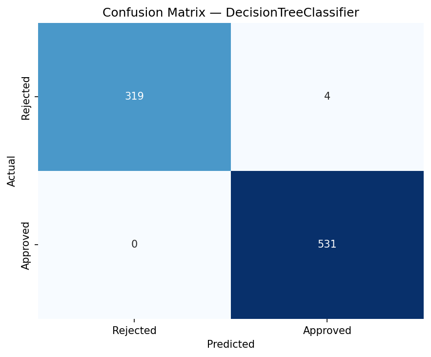
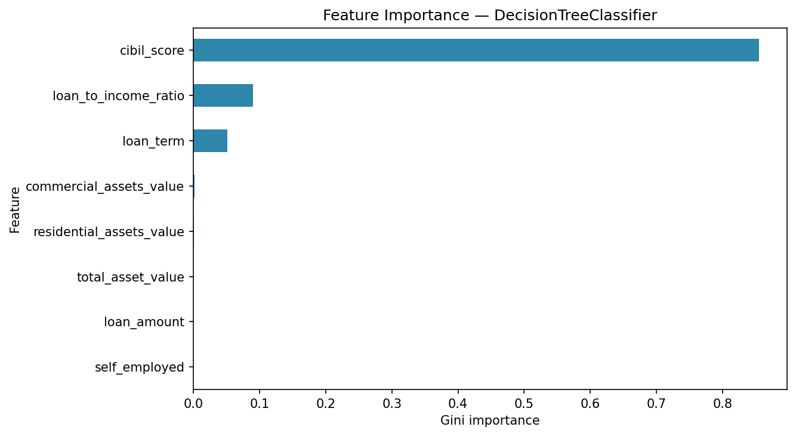
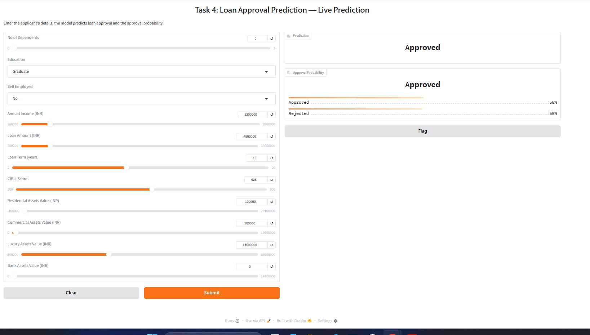

# 💰 Task 4: Loan Approval Prediction

[](https://www.python.org/)
[](https://scikit-learn.org/)
[](https://imbalanced-learn.org/)
[](https://pandas.pydata.org/)
[](https://www.gradio.app/)

A binary-classification pipeline that predicts whether a **loan application will be approved** from
the applicant's income, CIBIL credit score, education/employment status, and personal asset
holdings. Trained on the Kaggle **Loan Approval Prediction Dataset** (4,269 applications), the
project compares a **Logistic Regression** against a **Decision Tree** — the winner is chosen by
**5-fold stratified cross-validation** on the training fold, then scored **exactly once** on a
held-out test set. The Decision Tree reaches **99.53% weighted F1** (0.994 on the minority class),
beats a naive `cibil_score ≥ 600` rule by ~11 points, and is explained with real feature
importances. Because the target is imbalanced (62/38), performance is judged on **per-class
precision, recall, and F1** rather than accuracy alone.

---

## 📌 Project Overview

| | |
|---|---|
| **Problem** | Predict loan approval (binary) from financial & demographic applicant data |
| **Dataset** | [Loan Approval Prediction Dataset](https://www.kaggle.com/datasets/architsharma01/loan-approval-prediction-dataset) — 4,269 rows, 12 features |
| **Target** | `loan_status` — `Approved` (62.2%) / `Rejected` (37.8%) |
| **Approach** | Supervised binary classification with balanced class weights |
| **Best Model** | Decision Tree (5-fold CV-selected) — **99.53% weighted F1** on held-out test |
| **Bonus** | SMOTE oversampling · Logistic Regression vs. Decision Tree | 

---

## 📁 Project Structure

```
task4-loan-approval-prediction/
├── loan-approval-prediction.ipynb ← Main notebook (12 sections, fixed internship architecture)
├── app.py                      ← Standalone Gradio app (loads ./models/, zero notebook deps)
├── requirements.txt            ← Pinned dependencies
├── loan_approval_dataset.csv   ← Raw dataset
├── models/
│   ├── best_model.pkl          ← CV-selected Decision Tree (trained on scaled features)
│   ├── scaler.pkl              ← Fitted StandardScaler
│   ├── encoder.pkl             ← Fitted LabelEncoders (education, self_employed)
│   └── feature_names.pkl       ← Exact trained feature order (13 columns)
├── assets/
│   ├── results.png             ← Confusion matrix (evaluation step)
│   ├── feature_importance.png  ← Gini feature importances (real, from the fitted tree)
│   └── gradio_interface.png    ← Live interface screenshot
└── README.md                   ← This file
```

---

## 📊 Dataset

**Source:** [Loan Approval Prediction Dataset (Kaggle)](https://www.kaggle.com/datasets/architsharma01/loan-approval-prediction-dataset)

| Property | Value |
|---|---|
| Rows | 4,269 |
| Columns | 13 (12 features + target) |
| Missing values | None |
| Duplicates | None |
| Target | `loan_status` — `Approved` / `Rejected` |
| Imbalance ratio | 1.65× (majority / minority) |

### Features

| Group | Features |
|---|---|
| Numeric | `no_of_dependents`, `income_annum`, `loan_amount`, `loan_term`, `cibil_score`, `residential_assets_value`, `commercial_assets_value`, `luxury_assets_value`, `bank_asset_value` |
| Categorical | `education` (`Graduate`/`Not Graduate`), `self_employed` (`Yes`/`No`) |
| Identifier | `loan_id` (dropped) |
| Engineered | `total_asset_value`, `loan_to_income_ratio` |

### Class balance

| Class | Count | Percentage |
|---|---|---|
| Approved | 2,656 | 62.2% |
| Rejected | 1,613 | 37.8% |

> Approval is the **majority** class, so accuracy is an unreliable gauge — a naive "always
> approve" rule would already score ~62%. All conclusions below therefore lean on
> precision/recall/F1. Caveat: at 62/38 the imbalance is mild, so weighted F1 is numerically close
> to accuracy — the **per-class** numbers (minority class especially) are the real signal.

### EDA highlights

- **CIBIL score dominates.** Mean CIBIL for approved applicants is **703.5** vs **429.5** for
  rejected — the single clearest separator between the two classes.
- **Education and self-employment carry almost no signal.** Approval rate is ~62% for graduates
  and non-graduates alike, and identical for self-employed / employed applicants.
- **One raw-data quirk:** some headers and values ship with leading whitespace
  (`" no_of_dependents"`, `" Graduate"`, `" Approved"`) — fixed at load time with
  `skipinitialspace=True`.

---

## 🔬 Full Pipeline

```
Raw CSV → EDA → Preprocessing → Feature Engineering → Stratified Split → CV Model Selection → Evaluation → Feature Importance & Sanity Check → SMOTE Bonus → Artifacts → Gradio Demo
```

### 1. Data loading
Loaded with `pd.read_csv(..., skipinitialspace=True)`, which strips the leading-whitespace quirk
from headers and categorical values in one step. `loan_id` is dropped as it carries no predictive
signal.

### 2. Cleaning & preprocessing
- **Missing values:** the dataset ships complete (0 nulls), but a defensive median (numeric) /
  mode (categorical) imputation is kept so the pipeline generalizes to future rows with gaps.
- **Categorical encoding:** `education` and `self_employed` are binary, so `LabelEncoder`
  (0/1) is sufficient — no one-hot explosion needed.
- **Target encoding:** explicit `Approved → 1`, `Rejected → 0` so "Approved" is unambiguously
  the positive class.
- **Scaling:** `StandardScaler` on all 13 features — required by logistic regression and
  harmless for the decision tree.

### 3. Feature engineering
| Feature | Rationale |
|---|---|
| `total_asset_value` | Sum of the 4 asset columns — lenders judge overall net worth, not one account. |
| `loan_to_income_ratio` | Loan size ÷ annual income — a high ratio signals repayment burden / default risk. |

### 4. Train/test split
Stratified **80/20** split (`random_state=42`) keeping the Approved/Rejected ratio in both folds.
Train 3,415 · Test 854. The held-out test split is used **exactly once**; model selection happens
entirely inside the training fold via 5-fold CV (Section 7), so the reported test score is **not**
the product of selection on the test set.

---

## 🤖 Models Used

### Logistic Regression (baseline)
- **Why:** interpretable, scalable linear baseline to establish a floor.
- **Setup:** `class_weight='balanced'`, `max_iter=1000`, on standardized features.
- **CV result:** 0.9186 mean weighted F1 (±0.0158) over 5 folds.
- **Test result:** 92.31% weighted F1 — decent, but the linear decision boundary misses the sharp
  non-linear CIBIL cutoff.

### Model selection (5-fold stratified CV, training fold only)
The scaler is re-fitted inside every CV fold, so no held-out-fold or test-set information leaks
into the CV score. The two families are compared purely on mean weighted F1:

| Model | Mean CV weighted-F1 | ± std |
|---|---|---|
| Logistic Regression | 0.9186 | 0.0158 |
| **Decision Tree** | **0.9956** | 0.0038 |

The Decision Tree wins and is selected — **the test set has not been touched yet**.

### Decision Tree (final)
- **Why:** captures the non-linear interaction between CIBIL score, income, and assets; built
  with `class_weight='balanced'` and `min_samples_leaf=10` to resist overfitting.
- **Test result:** **99.53% weighted F1** (held-out test, evaluated once, after CV selection),
  minority-class F1 **0.994**, majority-class recall 100%.
- **Why it won:** the CIBIL-score effect is strongly threshold-like (approved ≈ >600), which a
  tree partitions exactly and a linear model can only approximate.

---

## 📈 Results

### Selection protocol (no selection-on-test)

Before any test-set score is reported, the two model families are compared by **5-fold stratified
cross-validation on the training fold only** (scaling re-fitted inside every fold):

| Model | Mean CV weighted-F1 | ± std |
|---|---|---|
| Logistic Regression | 0.9186 | 0.0158 |
| **Decision Tree** | **0.9956** | 0.0038 |

The Decision Tree is selected on those CV means; **only then** is it trained on the full training
fold and scored **once** on the held-out test set (854 apps; 323 Rejected / 531 Approved).

### Final model — Decision Tree (held-out test, single evaluation)

| Class | Precision | Recall | F1 | Support |
|---|---|---|---|---|
| **Rejected** (minority) | 1.0000 | 0.9876 | **0.9938** | 323 |
| Approved (majority) | 0.9925 | 1.0000 | 0.9962 | 531 |
| **Weighted F1** | | | **0.9953** | 854 |

Weighted F1 (0.9953) sits numerically close to accuracy because the target is only mildly
imbalanced (62/38) — the per-class row above is the honest signal. The model does **not** merely
echo "most people get approved": it keeps minority (Rejected) recall at **0.9876**, mislabeling
just 4 of 323 minority applications, and catches all 531 majority applications.

### Confusion matrix — Decision Tree (test set)

| | Predicted Rejected | Predicted Approved |
|---|---|---|
| **Actual Rejected** | 319 | 4 |
| **Actual Approved** | 0 | 531 |



### Feature importance (Decision Tree, Gini — real values, computed & plotted in notebook Section 9)



| Feature | Importance |
|---|---|
| `cibil_score` | **0.855** |
| `loan_to_income_ratio` | 0.090 |
| `loan_term` | 0.051 |
| All others | < 0.005 |

These numbers are produced by `best_model.feature_importances_` in the notebook — the table above
matches the code output exactly. The model effectively operationalizes what banks already weigh:
**credit history first, loan burden second.** `cibil_score` alone is ~86% of the tree's importance.

### Sanity-check baseline (`cibil_score >= 600 → Approved`)

| Model | Accuracy | Weighted F1 | Minority (Rejected) F1 |
|---|---|---|---|
| Rule baseline | 0.8841 | 0.8858 | 0.87 |
| **Decision Tree** | **0.9953** | **0.9953** | **0.99** |

The naive rule captures CIBIL's dominant signal but **rejects 97 genuinely approvable
applications** (majority recall drops to 0.82) because it ignores income/loan/asset interactions.
The tree corrects all of those while keeping minority recall at 0.99 — proof it is doing more than
thresholding a single feature.

---

## 🎁 Bonus work

- [x] **SMOTE oversampling** — balances training folds by synthesizing minority (Rejected)
  examples (train: 1,290 → 2,125), applied *after* the split to avoid leakage.
- [x] **Logistic Regression vs. Decision Tree** — both re-trained with and without SMOTE.

| Model | Precision | Recall | F1 | Weighted F1 |
|---|---|---|---|---|
| Decision Tree | 0.9925 | 1.0000 | 0.9962 | **0.9953** |
| Decision Tree + SMOTE | 0.9925 | 1.0000 | 0.9962 | **0.9953** |
| Logistic Regression | 0.9515 | 0.9228 | 0.9369 | 0.9231 |
| Logistic Regression + SMOTE | 0.9441 | 0.9228 | 0.9333 | 0.9183 |

> **Takeaway:** SMOTE balanced the class distribution but the Decision Tree was already splitting
> cleanly, so its score was unchanged, while SMOTE slightly *hurt* logistic regression — the
> synthetic samples shift its linear decision surface without adding real structure.

---

## 🖥️ Interface

Interactive **Gradio** demo — inputs on the left (dependents, education, employment, income,
loan amount/term, CIBIL score, asset values), predicted status + approval probability on the
right. It loads the saved artifacts from `./models/`, so `app.py` behaves identically to the
notebook's final section.



---

## ⚙️ How to Run

### Prerequisites
Python 3.12+ and the pinned dependencies:

```bash
pip install -r requirements.txt
```

### Run the Gradio app

```bash
python app.py
```

Then open the printed local URL (default `http://127.0.0.1:7860`).

### Run the notebook
1. Open `loan-approval-prediction.ipynb` in Jupyter / VS Code.
2. Ensure `loan_approval_dataset.csv` sits next to the notebook (it does).
3. Run all cells (**Kernel → Restart & Run All**). The final section launches the same interface
   with `demo.launch(share=True)` — use the public link for a screenshot.

### Libraries used

| Library | Purpose |
|---|---|
| `pandas` / `numpy` | Data loading, cleaning, numerics |
| `matplotlib` / `seaborn` | EDA plots and confusion matrix |
| `scikit-learn` | Preprocessing, models, metrics |
| `imbalanced-learn` | SMOTE oversampling (bonus) |
| `joblib` | Artifact persistence (`models/*.pkl`) |
| `gradio` | Live prediction interface |

---
