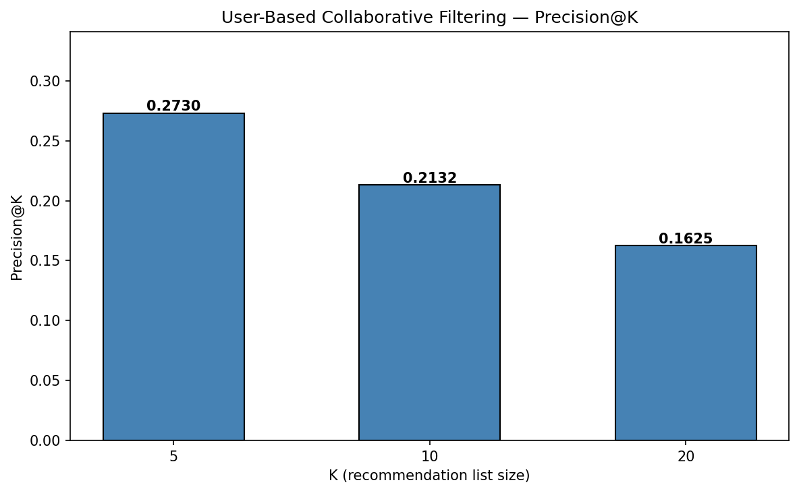
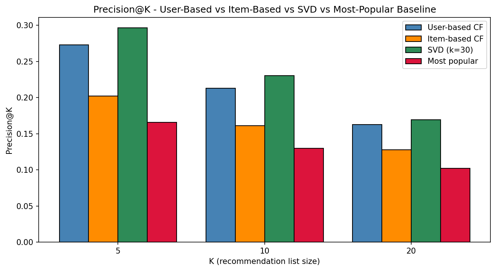
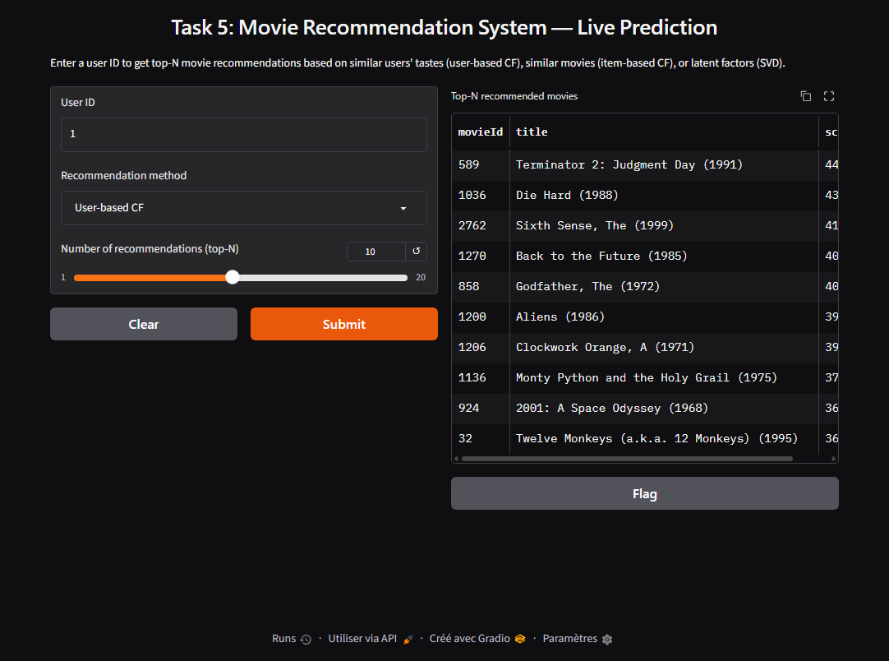

# 🎬 Task 5: Movie Recommendation System

[](https://www.python.org/)
[](https://scikit-learn.org/)
[](https://pandas.pydata.org/)
[](https://numpy.org/)
[](https://www.gradio.app/)

A collaborative-filtering pipeline that recommends movies a user will like by comparing their
taste against users who rate movies similarly. Built on the **MovieLens** dataset, the project
compares **user-based CF**, **item-based CF**, and **SVD matrix factorization** against a
non-personalized **most-popular baseline** on **precision@K** — with SVD coming out on top (0.296
at K=5) on every evaluation split. A live Gradio demo lets you enter any user ID and get a ranked
list of unseen, highly-scored movies.

---

## 📌 Project Overview

| | |
|---|---|
| **Problem** | Recommend movies a user hasn't seen, based on similar users' tastes and latent preference patterns |
| **Dataset** | [MovieLens (GroupLens)](https://www.kaggle.com/datasets/abhikjha/movielens-100k) — `ml-latest-small`: 100,836 ratings, 610 users, 9,724 movies, ratings on a 0.5–5.0 half-point scale |
| **Matrix** | 610 users × 2,269 movies (after popularity filter) — 98%+ sparse |
| **Best Method** | SVD matrix factorization — **Precision@5 = 0.2963** |
| **Bonus** | Item-based CF (`item_sim_matrix`) · SVD matrix factorization (`TruncatedSVD`) |

---

## 📁 Project Structure

```
task5-movie-recommendation-system/
├── dataset/                  ← Raw MovieLens files (ratings.csv, movies.csv, links.csv, tags.csv)
├── notebook.ipynb            ← Main notebook (11 sections, fixed internship architecture)
├── app.py                    ← Standalone Gradio app (loads ./models/, zero notebook deps)
├── requirements.txt          ← Pinned dependencies
├── models/
│   ├── user_item_matrix.pkl  ← Training matrix (users × movies, 0 = unrated)
│   ├── user_sim_matrix.pkl   ← User–user cosine similarity (primary method)
│   ├── item_sim_matrix.pkl   ← Movie–movie cosine similarity (bonus 1)
│   ├── svd_model.pkl         ← Fitted TruncatedSVD, k=30 (bonus 2)
│   ├── user_id_map.pkl       ← userId ↔ row index
│   ├── movie_id_map.pkl      ← movieId ↔ column index
│   └── movies_info.pkl       ← movieId → title/genres (display)
├── assets/
│   ├── results.png           ← Precision@K for the primary (user-based) method
│   ├── precision_comparison.png  ← Comparison chart (3 CF methods + most-popular baseline)
│   └── gradio_demo.png       ← Screenshot of the live interface
└── README.md                 ← This file
```

---

## Problem

Given a user's rating history, rank **unseen movies** by how likely they are to be liked — using
the implicit signal of *which users rate movies alike* — and score the ranking with **Precision@K**
against held-out high-rated movies.

## Dataset

**MovieLens (ml-latest-small)** — [GroupLens](https://grouplens.org/datasets/movielens/) (same
family as the task's recommended MovieLens 100K).

| Property | Value |
|---|---|
| Ratings | 100,836 (`userId, movieId, rating, timestamp`) |
| Users / Movies | 610 / 9,724 |
| Rating scale | 0.5 – 5.0 in **half-point** increments (this variant) |
| Sparsity | 98.3% of matrix cells empty |
| Most-rated movie | Toy Story (1995) |

Popularity filter: movies rated by **< 10 users** are dropped (2,269 kept) so all three
algorithms stay tractable and the comparison stays fair — near-zero-signal movies would add
memory blow-up for item–item/SVD with no recommender value.

## Approach

- **Preprocessing / matrix construction:** pivot `ratings.csv` → user-item matrix (rows = users,
  cols = movies). Missing cells stay **NaN** for Pearson, and a **0-filled copy** is used for
  cosine (safe: no real 0 ratings exist, so `0` unambiguously means *"no opinion"*).
- **Similarity method:** **cosine similarity** between users as the primary metric (Pearson
  correlation on co-rated items is demonstrated too, but in a 98%-sparse matrix co-rated pairs
  are too rare to be reliable). Top `NEIGHBORS = 50` similar users form the neighborhood.
- **Recommendation logic (user-based):** score each unseen movie as the **similarity-weighted
  *sum*** of neighbors' ratings — a sum rewards *consensus* (many similar users liking a movie),
  whereas a weighted *average* lets one obscure neighbor's 5.0 outrank a movie 50 similar users
  love. This single choice moved Precision@5 from **0.004 → 0.273** on the same held-out split
  (mean variant 0.0037 vs sum 0.2730 — reproduced cell-for-cell in notebook section **8.1**).
  Rank and return the top-K.

## Results

Held-out evaluation: for each of 600 eligible users, 20% of their **high-rated (≥ 4.0)** movies
are hidden; a recommendation counts as a hit if it appears in that hidden set. The split is random
(rather than temporal): a temporal split would evaluate the harder, more realistic task of
predicting *future* ratings, but would cold-start any user whose recent history gets truncated.

**Primary method — User-based CF (cosine, k=50):**

| Metric | Score |
|---|---|
| Precision@5  | **0.2730** ± 0.2619 |
| Precision@10 | **0.2132** ± 0.2077 |
| Precision@20 | **0.1625** ± 0.1594 |



**All methods + non-personalized baseline** (same split, same Precision@K protocol):

| K | User-based CF | Item-based CF | SVD (k=30) | Most popular (baseline) |
|---|---|---|---|---|
| 5  | 0.2730 | 0.2020 | **0.2963** | 0.1657 |
| 10 | 0.2132 | 0.1613 | **0.2303** | 0.1297 |
| 20 | 0.1625 | 0.1276 | **0.1692** | 0.1022 |



> **Takeaway:** SVD performs best at every K — it compresses the sparse interaction matrix into
> 30 latent factors that capture global structure (genre blocks, popularity bias) that raw
> user-item similarity cannot see. The margin over user-based CF is modest but consistent: across
> 5 independent random splits SVD wins 5/5 (P@5 = 0.289 ± 0.008 vs 0.269 ± 0.005), bigger than
> split-to-split variance even though per-user results spread widely (± ~0.26). User-based CF is
> second and strongest at smaller K; item-based CF trails because the movie–movie similarity
> signal is even sparser. The non-personalized most-popular baseline (0.166 @ K=5) trails every
> learned method, confirming the collaborative signal adds real value beyond raw popularity.

**Robustness across random splits** (5 seeds, P@5; notebook §9.4):

| Method | Mean ± std | Per-seed P@5 |
|---|---|---|
| User-based CF | 0.2693 ± 0.0053 | 0.2730 · 0.2660 · 0.2767 · 0.2640 · 0.2670 |
| SVD (k=30) | 0.2885 ± 0.0083 | 0.2963 · 0.2827 · 0.2980 · 0.2793 · 0.2860 |

SVD beats user-based CF on all 5 seeds by 0.015–0.023 in P@5, so the advantage is consistent
across splits rather than a single-split artifact.

## Interface

Interactive **Gradio** demo — enter a **User ID**, pick a method, and set the list size; the app
returns a ranked table of movie titles with scores. It loads the saved artifacts from `./models/`,
so `app.py` behaves identically to the notebook's final section.



## Bonus work

- [x] **Item-based collaborative filtering** — movie–movie cosine similarity; scores candidates
  by similarity to the user's top-rated movies. Precision@5 = **0.2020**.
- [x] **Matrix factorization (SVD)** — `TruncatedSVD` (k=30) decomposes the sparse training
  matrix into latent factors; predictions reconstructed via `inverse_transform(transform(X))`.
  Precision@5 = **0.2963** — the winner.

## How to run

```bash
pip install -r requirements.txt
python app.py
```

Then open the printed local URL (default `http://127.0.0.1:7860`).

### Run the notebook
1. Open `notebook.ipynb` in Jupyter / VS Code.
2. Ensure `dataset/ratings.csv` and `dataset/movies.csv` sit next to the notebook (they do).
3. Run all cells (**Kernel → Restart & Run All**). The final section launches the same interface
   with `demo.launch(share=True)` — use the public link for a screenshot.

### Libraries used

| Library | Purpose |
|---|---|
| `pandas` / `numpy` | Data loading, matrix construction, numerics |
| `scipy` | Sparse matrix input for SVD |
| `scikit-learn` | `cosine_similarity`, `TruncatedSVD` |
| `matplotlib` / `seaborn` | EDA plots and Precision@K charts |
| `joblib` | Artifact persistence (`models/*.pkl`) |
| `gradio` | Live prediction interface |