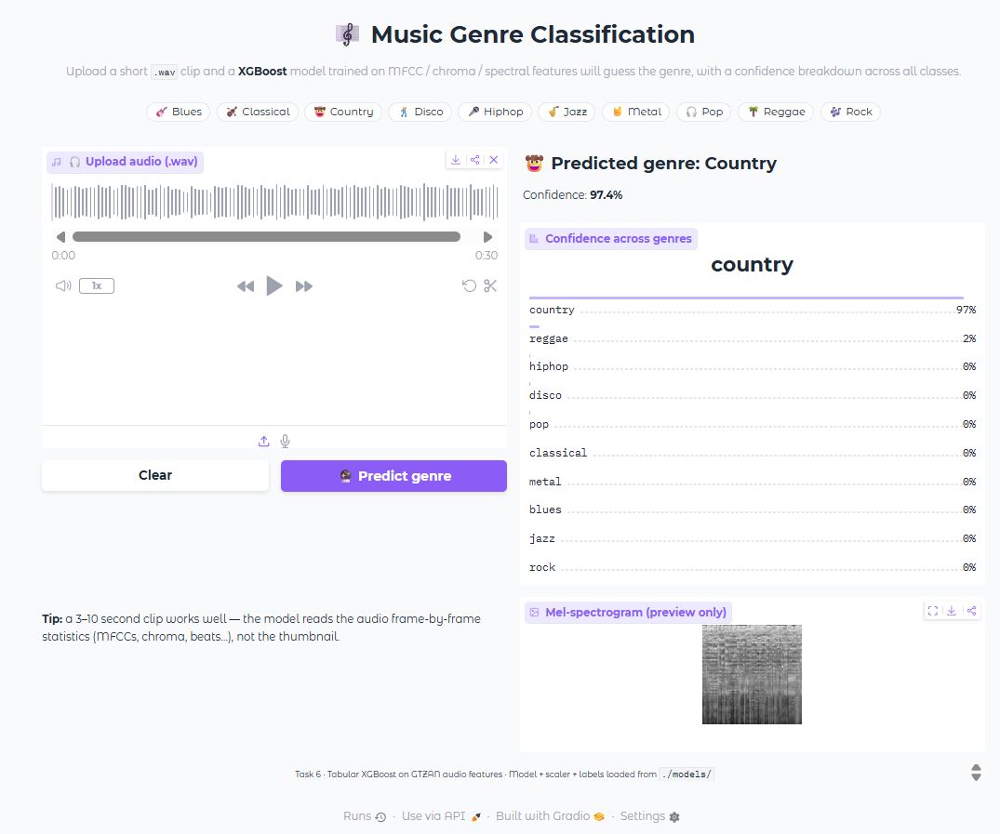

# Task 6: Music Genre Classification

## Problem
Classify audio clips into one of **10 music genres** (blues, classical, country, disco, hiphop, jazz, metal, pop, reggae, rock) from their sonic content.

## Dataset
[GTZAN Genre Collection (Kaggle)](https://www.kaggle.com/datasets/andradaolteanu/gtzan-dataset-music-genre-classification) — 1,000 audio clips (30s each), 10 genres × 100 tracks, with pre-generated mel-spectrogram images and pre-extracted audio features (MFCCs, chroma, spectral centroid, zero-crossing rate, tempo, etc.).

## Approach
- Feature extraction: mel-spectrogram images (`images_original/`) for the CNN; pre-extracted GTZAN audio features (`features_3_sec.csv`) for the tabular models.
- Model(s) tried: **CNN from scratch** (primary), **MobileNetV2 transfer learning** (bonus), and **RandomForest / GradientBoosting / XGBoost** on tabular features (bonus).
- Why this model: spectrograms are 2D spatial representations of audio, so convolutional layers directly capture local time–frequency patterns (rhythm, timbre, pitch). This is compared against cheap tabular models and a pretrained vision backbone.

## Results

The pipeline is **track-grouped at every split**. `features_3_sec.csv` is made of 3-second slices of the same 30s tracks, so both the outer train/test holdout and the inner train/validation holdout use `GroupShuffleSplit` on `track_id` — no track's slices ever straddle train, validation, or test. Tabular candidates are selected on the (grouped) **validation** macro-F1; the **test** score is reported once, for the selected model only. Rows are labeled with their evaluation set because the two families are not directly comparable (images vs. row-level audio features).

| Approach | Eval set | Track-grouped val Macro F1 | Test Macro F1 | Training time (s) |
|---|---|---|---|---|
| Tabular XGBoost (selected) | 1997 rows / 200 held-out tracks (3-s slices) | **0.7441** | **0.7016** | 4.9 |
| Tabular GradientBoosting | 1997 rows / 200 held-out tracks (3-s slices) | 0.7294 | — | 258.0 |
| Tabular RandomForest | 1997 rows / 200 held-out tracks (3-s slices) | 0.7109 | — | 1.3 |
| Transfer Learning (MobileNetV2) | 160 held-out spectrogram images (1/track) | — | 0.6163 | 132.7 |
| CNN (from scratch) | 160 held-out spectrogram images (1/track) | — | 0.5708 | 178.6 |

> Best model: **Tabular XGBoost** — selected on track-grouped validation macro-F1 (0.7441) and evaluated once on the held-out test set (0.7016). Within the tabular family XGBoost wins; among the image-based models MobileNetV2 transfer learning is the strongest (0.6163 test macro-F1). All models beat the 0.10 random baseline.

**Why validation differed from test before this audit fix:** the original inner validation split was done at row level (ungrouped `train_test_split` on the 3-second slices), so slices of the same track appeared in both training and validation. That leakage inflated the reported validation accuracy to **0.9043** while the track-grouped test accuracy sat at **0.7211** — validation was seeing near-duplicates of training audio, not truly unseen tracks. After switching the inner split to `GroupShuffleSplit` grouped on `track_id`, the honest validation accuracy drops to **0.7416** (macro-F1 0.7441), closely tracking the test result. A validation number that is dramatically higher than the test number is a warning sign for leakage like this.


## Interface
Upload a `.wav` file; the app serves the **deployed Tabular XGBoost model** (the one selected on track-grouped validation). It reproduces the exact 57 GTZAN features the model was trained on, in the same column order (`feature_names.pkl`), then shows the predicted genre and confidence across all 10 genres. The mel-spectrogram image is shown as a visual preview only — it is not model input, so there is no train/serve mismatch (the CNN and MobileNetV2 models are kept for offline comparison and are intentionally not served).



## Bonus work
- [x] Tabular approach (MFCC/audio features) with **track-grouped** train AND validation splits to avoid leakage
- [x] Image-based CNN (from scratch) vs. tabular comparison
- [x] Transfer learning (MobileNetV2) — frozen base then fine-tuning

## How to run
```bash
pip install -r requirements.txt
python app.py
```