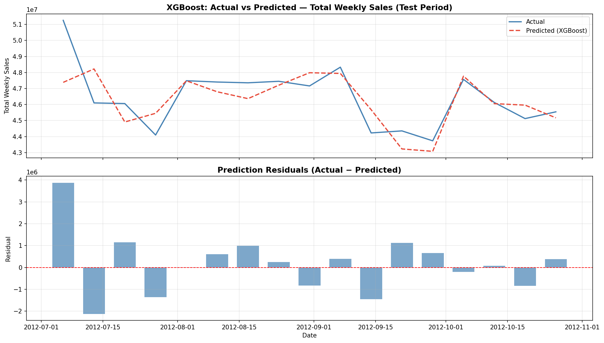
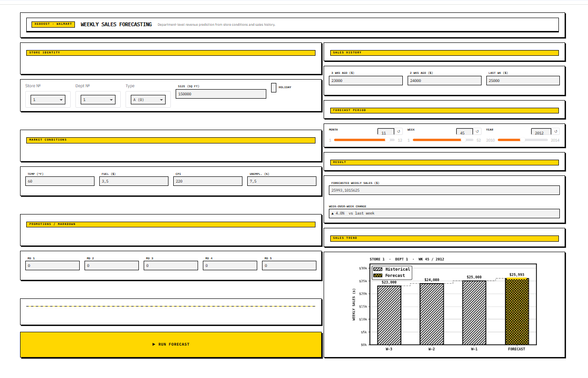

# Task 7: Sales Forecasting

## Problem
Predict the next week's sales for each Walmart store and department based on historical weekly sales, store characteristics, and external economic factors.

## Dataset
[Walmart Sales Forecast (Kaggle)](https://www.kaggle.com/datasets/aslanahmedov/walmart-sales-forecast) — 421,570 weekly sales records across 45 stores and 81 departments (Feb 2010 – Oct 2012), plus store metadata, external features (temperature, fuel price, markdowns, CPI, unemployment), and holiday flags.

## Approach
- Feature engineering: Calendar features (day/month/week/year), 1/2/3-week lag values, 4/8/13-week rolling averages, day-since-start trend, store type encoding. All lag/rolling features are causal (`shift(1)`) and computed per (Store, Dept).
- Predictive split: chronological holdout with **cutoff 2012-07-01** (train 360,274 rows → test 50,152 rows).
- Model(s) tried: Naive persistence baselines, Linear Regression (baseline), XGBoost Regressor (final).
- Why this model: XGBoost captures non-linear feature interactions and is robust to unscaled/mixed data, beating both the naive persistence floor and the linear model.
- Baseline framing: the naive references are (a) "repeat same week last year" (52-week seasonal persistence — the natural benchmark for this strongly seasonal data, scored on the 48,879 holdout rows that have a prior-year value) and (b) "repeat 3 weeks ago" (covers every holdout row). Any real model must beat these; improvement is reported against them rather than against another trained model.

## Results
| Model | MAE | RMSE |
|---|---|---|
| Naive persistence (same week last year, n=48,879) | 1,717.20 | 3,588.94 |
| Naive persistence (repeat 3 weeks ago, n=50,152) | 2,067.60 | 4,674.51 |
| Linear Regression (features) | 1,774.18 | 3,329.10 |
| **XGBoost (final)** | **1,360.85** | **2,860.95** |

- **XGBoost beats the persistence floor by 19.0% on MAE and 19.3% on RMSE** (like-for-like on the same 48,879 rows as the seasonal baseline). XGBoost vs Linear Regression: 23.3% MAE / 14.1% RMSE (for reference).
- TimeSeriesSplit (5-fold, scored only on pre-cutoff data): MAE **2,190.59 ± 720.25**, RMSE **6,607.92 ± 3,256.71**. CV is higher than the holdout by design — cross-validation averages over 2010–2012 windows that include high-variance holiday periods (fold 2, spanning Thanksgiving/Christmas, is the worst at MAE 3,599.60) and much shorter training windows (as little as 20 weeks in fold 1), while the single 17-week summer holdout (Jul–Oct 2012) is evaluated with the full 126-week history. The two are consistent once training history and seasonality are accounted for; the holdout sits at the low end of the CV band rather than contradicting it.
- Note: an earlier pass validated CV on the full frame including the holdout (MAE 1,907.26 ± 542.45); its last fold contained 50,152 holdout rows (73.3% of that fold), double-counting the test period. The corrected CV above excludes the holdout entirely.



## Interface
The Gradio app (`app.py`) lets you pick a store/dept, market conditions, the last 13 weekly sales (most recent last, comma-separated, pre-filled from real history), and a forecast week. The forecast date is snapped to the Friday of that ISO week, and day-of-week/month/week/year/lags/4-8-13-week rolling averages are derived from those inputs exactly as in training.



## Bonus work
- [x] Seasonal decomposition (statsmodels) of weekly sales into trend, seasonal, residual components.
- [x] Time-aware validation with TimeSeriesSplit (5 folds) on XGBoost, scored strictly on pre-cutoff data.

## How to run
```bash
pip install -r requirements.txt
python app.py
```

*Note: MAE/RMSE are from the trained XGBoost model on the chronological test split (cutoff 2012-07-01). Run `task7-sales-forecasting-notebook.ipynb` to regenerate exact scores.*
