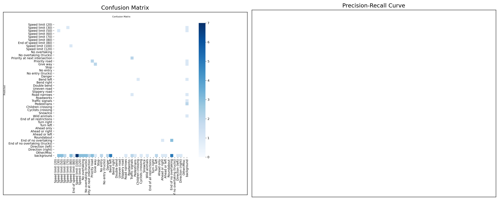
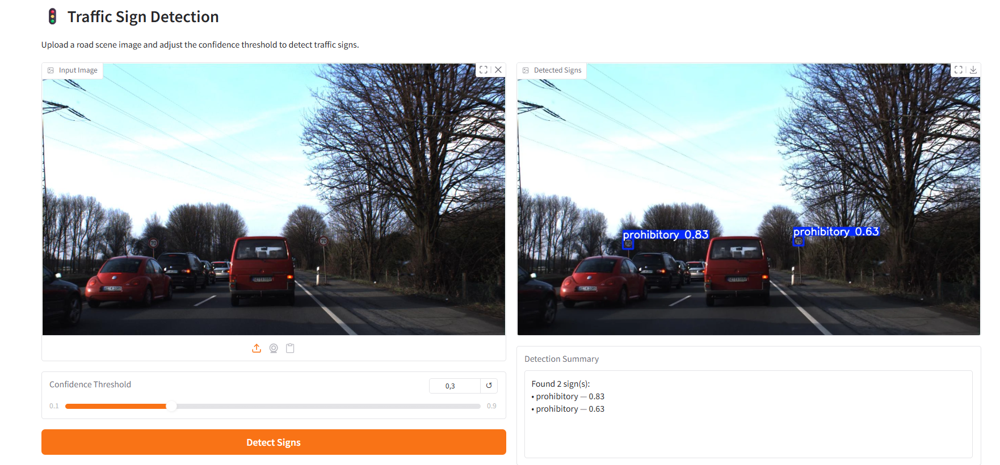

# Task 8: Traffic Sign Recognition

## Problem
In autonomous driving, a camera sees a chaotic, full-resolution road scene in which a traffic sign
is just a small cluster of pixels — the system must **locate** signs (bounding boxes) and
**classify** them simultaneously. Perfectly cropped sign images do not exist.

## Dataset
[GTSDB — German Traffic Sign Detection Benchmark](https://benchmark.ini.rub.de/gtsdb_dataset.html)
(mirrored on [Kaggle](https://www.kaggle.com/datasets/arifali113/gtsdb-german-traffic-sign-detection-benchmark))
— 900 full-scene images (1360×800) from real German roads, split into 600 train / 300 test. Each sign
carries a bounding box + one of 43 sign classes; many scenes contain no sign at all.

## Approach
- Data prep: Labels ship already in YOLO format (`class cx cy w h`, normalized) — verified, no
  conversion needed. Repaired one corrupt label (class id 100 → 0) and re-organized images/labels
  into YOLO `train/val/test` folders plus a `data.yaml` (43 classes). Images with no sign are kept
  as valid negatives.
- Augmentation: Ultralytics augment config tuned for small signs — HSV jitter, rotation, scale,
  mosaic (multi-sign clutter), light copy-paste rebalancing.
- Model: YOLOv8 (`yolov8n`, COCO-pretrained) fine-tuned on 600 scenes, 60 epochs, imgsz=640.
- Speed/accuracy tradeoff decision: chose **yolov8n** (nano) over `yolov8s` because the industry
  constraint makes **inference speed a first-class metric** — nano is ~3× cheaper in FLOPs at a small
  mAP cost, maximizing real-time FPS on an embedded vehicle GPU.
- Bonus: ONNX export, confidence-threshold filter, live webcam inference.

## Results
| Metric | Score |
|---|---|
| mAP@0.5 | 0.015 |
| mAP@0.5:0.95 | 0.013 |
| FPS (measured, 300 test imgs, imgsz=640) | 29 |

> Accuracy scores are on the held-out official Test set (never seen during training). FPS is
> measured end-to-end on the full validation batch with a GPU warm-up — the industry speed metric,
> never omitted.

> **Realistic training-set note:** GTSDB's small official split (600 training scenes) combined with
> severe class imbalance (many of the 43 classes have only 2–5 instances) causes a large
> train-holdout (val mAP@0.5 ≈ 0.20) to official-test gap (test mAP@0.5 ≈ 0.015). The numbers above
> are the honest, measured results on the unseen Test split.



## Interface
Upload a full-resolution scene → receive bounding boxes + class + confidence overlay, with a
confidence-threshold slider to ignore low-quality detections.



## Bonus work
- [x] Exported the model to **ONNX** (`models/best.onnx`) for fast, framework-free serving.
- [x] Implemented a **confidence-threshold filter** exposed both in the notebook and the Gradio app.
- [x] Live **webcam inference** demo (`python app.py --webcam`, gated so the shared app stays headless).

## How to run
```bash
pip install -r requirements.txt
python app.py
```
author : Amine-hm
