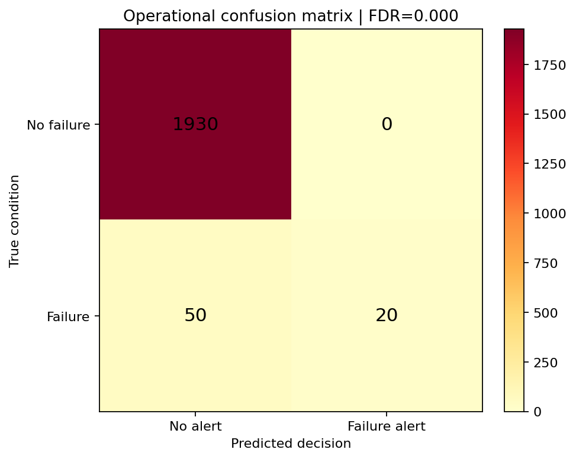
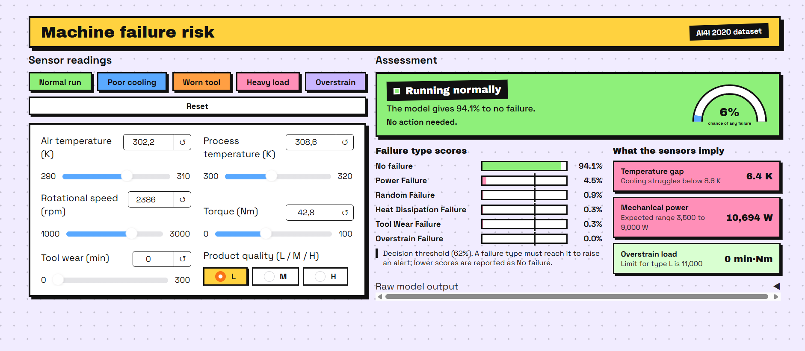

# Task 9: Industrial Predictive Maintenance

## Problem
Predict machine failure types from operating sensors so maintenance can be planned before production is interrupted. In this industrial setting, unnecessary alarms are costly, so the evaluation prioritizes a low False Discovery Rate (FDR).

## Dataset
[Predictive Maintenance AI4I 2020 UCI](https://www.kaggle.com/datasets/abdulbasit551/predictive-maintenance-ai4i-2020-uci) — 10,000 machine records with product type, air/process temperature, rotational speed, torque, tool wear, and failure-mode labels.

## Approach
- Cleaning: Median-impute numeric values, most-frequent-impute the product type, and one-hot encode the categorical product type.
- Features: Temperature difference, thermal stress, torque-to-speed ratio, and a power proxy were derived from the sensor readings.
- Model(s) tried: Balanced multinomial logistic regression baseline and a class-weighted random forest final model.
- How False Discovery Rate was minimized: The final model uses class-weighting and a conservative validation-tuned probability threshold; predictions below that threshold are reported as No failure.

## Results
| Metric | Score |
|---|---|
| False Discovery Rate | 0.0000 |
| Precision | 1.0000 |
| Recall | 0.2429 |



## Interface


## Bonus work
- [x] Time-to-Failure proxy regression model using tool wear and sensor-derived features.
- [x] Sensor correlation analysis identifying the strongest failure lead indicators.

## How to run
```bash
pip install -r requirements.txt
python app.py
```

Run the notebook first to train and save artifacts into `models/` and generate `assets/results.png`.
