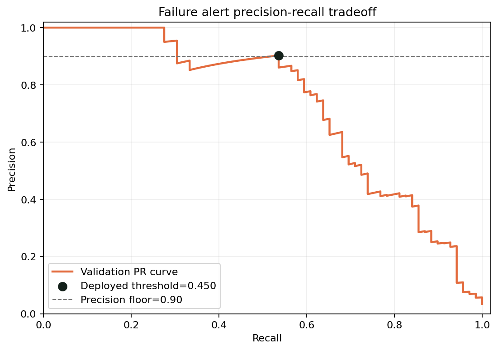

# Task 9: Industrial Predictive Maintenance

## Problem
Predict machine failure types from operating sensors so maintenance can be planned before production is interrupted. In this industrial setting, unnecessary alarms are costly, so the evaluation tracks the False Discovery Rate (FDR); but refusing to alert on anything uncertain is a failure mode in itself, so the model keeps a deliberately non-conservative threshold that recovers real failures at an accepted ~10% validation FDR.

## Dataset
[Predictive Maintenance AI4I 2020 UCI](https://www.kaggle.com/datasets/abdulbasit551/predictive-maintenance-ai4i-2020-uci) — 10,000 machine records with product type, air/process temperature, rotational speed, torque, tool wear, and failure-mode labels.

## Approach
- Cleaning: Median-impute numeric values, most-frequent-impute the product type, and one-hot encode the categorical product type.
- Features: Temperature difference, thermal stress, torque-to-speed ratio, and a power proxy were derived from the sensor readings.
- Model(s) tried: Balanced multinomial logistic regression baseline and a class-weighted random forest final model (`models/failure_model.joblib`).
- Decision rule: The threshold is tuned on the **validation** split (highest recall with validation precision ≥ 0.90), then frozen. It is reported only as a validation-time constraint — never as a production number. Test-set results below are produced by loading the shipped artifact and re-running it on the untouched test split, so they match the deployed model exactly.

## Results

### Test-set results (production numbers)
Produced by loading `models/failure_model.joblib` and running it on the untouched 2,000-row test split with `decision_threshold = 0.4496`.

| Metric | Test set |
|---|---|
| False Discovery Rate | 0.1887 |
| Precision | 0.8113 |
| Recall | 0.6143 |
| Accuracy | 0.9815 |
| Macro F1 (6 classes) | 0.5721 |

Out of 70 true failures in the test set, 43 are alerted correctly, 27 are missed, and 10 alerts are false alarms (confusion matrix `[[1920, 10], [27, 43]]`).

### Per-failure-mode (test set)
The aggregate numbers above hide the two rarest classes, so the per-class report is shown explicitly. Random Failure (test support 4) and Tool Wear Failure (test support 9) still have near-zero recall at the corrected threshold — a direct consequence of their extremely low sample counts, not a tuning mistake:

| Failure mode | Test support | Precision | Recall | F1 |
|---|---|---|---|---|
| Heat Dissipation Failure | 23 | 0.7857 | 0.9565 | 0.8627 |
| Overstrain Failure | 16 | 0.8462 | 0.6875 | 0.7586 |
| Power Failure | 18 | 0.8182 | 0.5000 | 0.6207 |
| Tool Wear Failure | 9 | 1.0000 | 0.1111 | 0.2000 |
| Random Failure | 4 | 0.0000 | 0.0000 | 0.0000 |
| No failure | 1930 | 0.9861 | 0.9948 | 0.9905 |
| **Macro average** | 2000 | 0.7394 | 0.5417 | 0.5721 |

### Validation-set constraint (tuning-time, NOT production FDR)
The threshold 0.4496 was chosen on the validation split with the constraint **validation precision ≥ 0.90** (i.e. validation FDR ≤ 0.10). The achieved validation operating point was precision 0.9024, recall 0.5362, FDR 0.0976. This is a tuning constraint and must not be read as the deployed FDR; the deployed (test) numbers are in the table above.




## Interface


## Bonus work
- [x] Sensor correlation analysis identifying the strongest failure lead indicators (highest absolute correlation with machine failure: **Torque**).
- ~~Time-to-Failure (RUL) regression~~ **Honestly retracted.** The original bonus target `250 − Tool wear` is a deterministic linear function of an input feature, so an MAE of 0.002 was a tautology, not evidence of learning. The AI4I 2020 dataset has no time index and no cycles-to-failure column, so no genuine degradation signal exists that the model does not already see directly; RUL estimation was therefore not shipped and the stale `rul_model.joblib` artifact was removed.

## How to run
The canonical artifacts (`models/failure_model.joblib`, `models/feature_encoder.joblib`, `models/metadata.joblib`) are committed. Start the interface:

```bash
pip install -r requirements.txt
python app.py
```

Run `notebook.ipynb` to walk through the full pipeline and verify that its Section 8 (Evaluation) reproduces exactly the test-set numbers above — it loads the shipped artifact rather than a freshly retrained copy, so the notebook, README, and deployed model always agree.